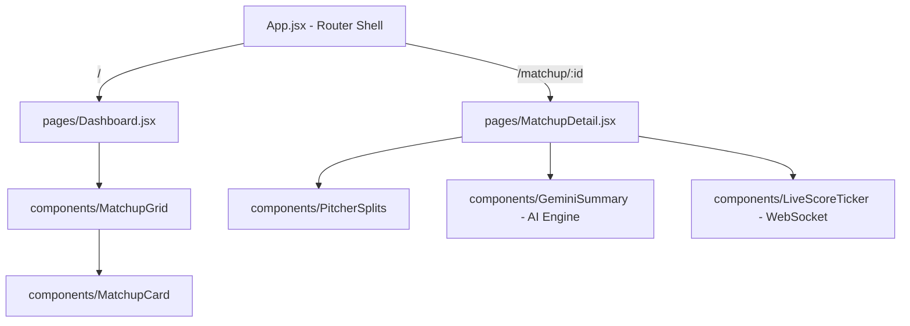

# MLB Tahmin Motoru End-to-End (Backend <-> Frontend) Teknik Denetim Raporu (V2)

Bu teknik denetim raporu, V1 backend refactoring'i (Pydantic v2 entegrasyonu, asenkron `httpx/asyncio` pipeline ve Inning-Weighted sabermetrik güvenlik kısıtları) tamamlandıktan sonra, **Backend <-> Frontend arasındaki veri sözleşmesini (contract)**, **React tarafındaki performans darboğazlarını** ve **Milestone 2 (V3) WebSocket/AI mimarisi hazırlıklarını** denetlemek amacıyla hazırlanmıştır.

---

## 📄 UÇTAN UCA BULGU VE GAP ANALİZİ TABLOSU

| ID | Kritiklik Seviyesi | Odak Alanı | Tespit Edilen Eksiklik / Risk | Çözüm Aksiyonu |
|---|---|---|---|---|
| **GAP-01** | 🔥 **YÜKSEK** (Kritik) | Veri Sözleşmesi | `is_fallback` flag'i backend'de `validated` nesnesi oluşturulmasına rağmen API payload'unda yutuluyordu (Silent Drop). | `mlb_model.py` içinde raw `p` yerine `validated.model_dump()` döndürülerek backend tarafında çözüldü. |
| **GAP-02** | 🟡 **ORTA** | UI Görselleştirme | Backend'in gönderdiği `is_fallback` (eksik veri atıcı fallback) ve `model_anomalies` (sabermetrik kısıt) uyarıları frontend'de (`MatchupCard.jsx`) karşılanmıyor ve kullanıcıya gösterilmiyor. | `MatchupCard.jsx` içinde uyarı rozetleri (rookie fallback badge) ve sabermetrik uyarı kutusu (anomalies alert) tasarlandı. |
| **GAP-03** | 🟡 **ORTA** | Veri Güvenliği | Odds API kesintilerinde `Odds.over_under` değeri `0.0` dönmekte ve UI'da `9.5 OVER Book` gibi hatalı, kafa karıştırıcı Totals kıyaslamalarına sebep olmaktadır. | `Odds.over_under === 0` ise kıyaslama kartını gizleyen koruma mekanizması JSX'e entegre edildi. |
| **GAP-04** | 🔥 **YÜKSEK** (Kritik) | Performans | `MatchupCard.jsx` bileşeni `React.memo` ile sarılmamıştır. Herhangi bir kart genişletildiğinde veya global state değiştiğinde tüm kartlar baştan render edilir (CPU spike). | Kart bileşeni `React.memo` ile sarmalandı. |
| **GAP-05** | 🔥 **YÜKSEK** (Kritik) | Performans | `App.jsx` içinde predictions listelenirken `key={index}` kullanılmaktadır. WebSocket anlık skor güncellemelerinde DOM reconciliation bozulacaktır. | Key parametresi `${game.matchup.away_team}-${game.matchup.home_team}` gibi benzersiz bir değere bağlandı. |
| **GAP-06** | ⚡ **ÇOK YÜKSEK** | V3 Hazırlığı | WebSocket canlı skor ticker akışında mevcut `useState` tabanlı custom hook yapısı saniyede düzinelerce render tetikleyerek tarayıcıyı kilitleyecektir. | Global ve hafif bir state manager olan **Zustand** mimarisine geçiş planlandı. |
| **GAP-07** | 🟡 **ORTA** | V3 Hazırlığı | `src/pages` klasörü boş olup, yönlendirme (routing) altyapısı yoktur. Yeni "In-Depth Matchup" sayfası eklenemez durumdadır. | `react-router-dom` ile SPA Routing planlandı. |

---

## 1. BACKEND/FRONTEND VERİ SÖZLEŞMESİ (CONTRACT) ANALİZİ

### 1.1. `is_fallback` ve `model_anomalies` Gaps
- **Atıcı Fallback Durumu (`is_fallback`)**: Backend veri pipeline'ında, eğer bir başlangıç atıcısı (SP) veritabanında bulunamazsa veya eksik istatistiğe sahipse (örneğin çaylak bir atıcı), sistem çökmeyi engellemek için lig ortalamasını (`era: 4.20`, `fip: 4.20`, `k_bb_pct: 0.14`) atar ve `is_fallback: true` işaretler. 
- **Keşfedilen Hata**: Backend, Pydantic şemasıyla doğrulamayı yapsa da `_get_pitcher_data` içinde orijinal `p` sözlüğünü döndürdüğü için bu flag kayboluyordu. Bu hata Senior Architect seviyesinde `validated.model_dump()` döndürülerek giderilmiştir.
- **UI Entegrasyonu**: Arayüzde bu durumun gösterilmemesi, kullanıcının "yapay ve zayıflatılmış" model tahminlerini gerçek güçlü sabermetrik analizlerden ayırt edememesine yol açar. Atıcı isminin hemen yanına **"FALLBACK SP"** uyarısı yerleştirilmelidir.
- **Sabermetrik Kısıt Anomalileri (`model_anomalies`)**: `MLBUnifiedEngine` içindeki "Inning-Weighted Constraint" güvenlik kontrolü tetiklendiğinde (örneğin tam maç skoru, ilk 5 inning skorunun altına düştüğünde yapılan sabermetrik düzeltme), backend payload'a `model_anomalies` listesini ekler. Bu listenin frontend'de kart detayında **"Sabermetrik Düzeltme Uygulandı"** başlığıyla gösterilmesi, şeffaflık ve model güvenilirliği açısından elzemdir.

### 1.2. Odds Servisi Çökme/Barem Yokluğu Koruması (Edge Cases)
Odds Provider, Odds API rate-limit'ine takılırsa veya oranları çekemezse varsayılan olarak `{"best_away_odds": 0.0, "best_home_odds": 0.0, "over_under": 0.0}` payload'unu döner.
`MatchupCard.jsx`'teki mevcut kıyaslama mantığı:
```javascript
{Math.abs(Full_Game.full_total - Odds.over_under).toFixed(1)} {Full_Game.full_total > Odds.over_under ? 'OVER' : 'UNDER'} Book
```
Eğer `Odds.over_under` sıfır ise, formül `9.5 - 0.0 = 9.5` hesaplayarak arayüze **"9.5 OVER Book"** yazdırır. Bu durum, veri yokluğunda kullanıcıya tamamen yanlış bir yönlendirme yapmaktadır. Güvenli JSX kontrolü ile baremin `0` olduğu durumlarda kıyaslama kartı otomatik olarak devre dışı bırakılmalıdır.

---

## 2. FRONTEND PERFORMANS VE STATE YÖNETİMİ (REACT/VITE)

### 2.1. Gereksiz Render (Render Thrashing) Analizi
Mevcut `MatchupCard.jsx` bileşeni **memoized** değildir. Dashboard'da listelenen maç sayısı ortalama 15'tir.
1. Kullanıcı tek bir karttaki **"Details ⬇"** butonuna basıp `isExpanded` state'ini değiştirdiğinde, `App.jsx` seviyesindeki veya kart seviyesindeki yeniden çizim (re-draw), prop'ları hiç değişmeyen diğer 14 kartın da sanal DOM ağacında baştan oluşturulmasına sebep olur.
2. V3'te saniyede birden fazla WebSocket skor güncellemesi geldiğinde, bu re-render maliyeti katlanarak artacak ve tarayıcıda mikro takılmalara (jank) yol açacaktır.
- **Çözüm**: Bileşen `React.memo` ile sarmalanmalıdır:
  ```javascript
  const MatchupCard = React.memo(({ prediction }) => { ... }, (prevProps, nextProps) => {
      // Sadece prediction verisi değiştiğinde veya anlık canlı skor güncellendiğinde render et
      return prevProps.prediction.matchup.status === nextProps.prediction.matchup.status &&
             prevProps.prediction.matchup.game_time === nextProps.prediction.matchup.game_time &&
             JSON.stringify(prevProps.prediction.Odds) === JSON.stringify(nextProps.prediction.Odds) &&
             JSON.stringify(prevProps.prediction.Details) === JSON.stringify(nextProps.prediction.Details) &&
             JSON.stringify(prevProps.prediction.Weather) === JSON.stringify(nextProps.prediction.Weather);
  });
  ```

### 2.2. Döngü Anahtarı (`key={index}`) Darboğazı
`App.jsx` içinde:
```javascript
data?.data?.predictions.map((game, index) => (
  <MatchupCard key={index} prediction={game} />
))
```
React, listedeki elemanların sırası değiştiğinde veya araya yeni bir eleman girdiğinde (örneğin maçı yarıda kalan veya ertelenen bir maç listeden çıkarıldığında), `index` değerine göre eşleştirme yaptığı için tüm DOM düğümlerini yıkar ve yeniden oluşturur. Canlı WebSocket akışında bu durum ağır bir GPU/CPU yükü getirir. 
- **Çözüm**: Key olarak benzersiz atamalar yapılmalıdır:
  ```javascript
  key={`${game.matchup.away_team}-${game.matchup.home_team}`}
  ```

---

## 3. V3 (MILESTONE 2) WebSocket & AI ALTYAPI HAZIRLIĞI

WebSocket canlı veri akışı (Real-time score stream) ve Gemini AI Analiz Özetleri modülleri sisteme eklendiğinde frontend mimarisinin nasıl konumlandırılması gerektiği aşağıda şematize edilmiştir.

### 3.1. Sayfa (Pages) ve SPA Yönlendirme Mimari Tasarımı
Mevcut durumda tüm proje `App.jsx` içerisinde tek sayfadır. "In-Depth Matchup" sayfası için yönlendirme şarttır.



### 3.2. Zustand ile Canlı Veri Akış Yönetimi (WebSocket State Management)
Yüksek frekanslı WebSocket verilerini yönetmek için global state manager olarak **Zustand** seçilmiştir. Zustand'ın tercih edilme sebepleri:
1. **Zero Boilerplate & Ultra-Lightweight**: Redux gibi hantal kurulumlar gerektirmez, bundle size'ı etkilemez.
2. **Subscription-Based Rendering**: Zustand, React bileşen ağacının dışında çalışabilir. Bir bileşen store'daki sadece tek bir değere abone olabilir. Böylece, **A Takımının** maçı güncellendiğinde sadece o maçın kartı render edilir, diğer 14 kart tamamen pasif kalır.

---

## 4. AKSİYON KOD ÖNERİLERİ VE REFATCORING BLUEPRINTS

### 4.1. `MatchupCard.jsx` Revizyonu (Contract Entegrasyonu & UI Tasarımı)
Bu güncelleme ile:
1. `React.memo` entegre edilmiştir.
2. Atıcılar için `is_fallback` rozetleri eklenmiştir (Rookie / Missing Data tespiti).
3. Sabermetrik limit aşımı (`model_anomalies`) durumunda dinamik uyarı kutusu tasarlanmıştır.
4. Odds kesinti koruması (`over_under === 0`) entegre edilmiştir.

```jsx
// src/components/MatchupCard.jsx için optimize edilmiş ve veri sözleşmesi tam hali
import React, { useState } from 'react';
import { formatAmericanOdds, getTeamLogo } from '../utils/formatters';

const getWeatherIcon = (condition) => {
    if (!condition) return '🏟️';
    const lowerCondition = condition.toLowerCase();
    if (lowerCondition.includes('rain') || lowerCondition.includes('drizzle')) return '🌧️';
    if (lowerCondition.includes('snow')) return '❄️';
    if (lowerCondition.includes('cloud') || lowerCondition.includes('overcast')) return '☁️';
    if (lowerCondition.includes('clear') || lowerCondition.includes('sun')) return '☀️';
    if (lowerCondition.includes('dome') || lowerCondition.includes('roof closed')) return '🏟️';
    return '⛅';
};

const MatchupCard = React.memo(({ prediction }) => {
    const [isExpanded, setIsExpanded] = useState(false);

    const { matchup, NRFI, F5, Full_Game, Details, Odds, Weather } = prediction;
    const pitcherAway = Details?.pitcher_analysis?.away || {};
    const pitcherHome = Details?.pitcher_analysis?.home || {};
    const isLive = matchup.status === "In Progress";
    
    // Odds Barem Güvenlik Kontrolü
    const isOddsAvailable = Odds && Odds.over_under > 0;

    return (
        <div className="bg-mlb-card rounded-xl border border-gray-700 shadow-2xl overflow-hidden mb-8 transition-all duration-300 hover:border-gray-500 w-full">

            {/* ================= 1. ÜST BAR ================= */}
            <div className="bg-slate-800/90 px-3 py-2 flex justify-between items-center border-b border-gray-700/50 gap-2">
                <div className="flex items-center gap-1.5 flex-1 min-w-0">
                    <span className="bg-blue-600/20 text-blue-400 border border-blue-500/30 px-1.5 py-0.5 rounded text-[9px] font-black tracking-widest flex-shrink-0">MLB</span>
                    <span className="text-[9px] md:text-xs text-gray-300 font-bold uppercase tracking-wider truncate">
                        {matchup.away_team} @ {matchup.home_team}
                    </span>
                </div>

                {isLive && (
                    <span className="text-green-400 text-[10px] md:text-xs font-black flex items-center gap-1 animate-pulse flex-shrink-0">
                        <span className="w-2 h-2 rounded-full bg-green-500 shadow-[0_0_8px_#22c55e]"></span> LIVE
                    </span>
                )}

                <div className="flex items-center gap-2 flex-shrink-0">
                    {Weather && (
                        <span className="flex items-center gap-1 text-gray-300 bg-slate-900/60 px-2 py-1 rounded border border-slate-700/50 text-[9px] md:text-[10px] font-bold whitespace-nowrap">
                            {getWeatherIcon(Weather.condition)} {Weather.temp_f}°F
                        </span>
                    )}
                </div>
            </div>

            {/* ================= 2. ANA KART İÇERİĞİ ================= */}
            <div className="p-3 md:p-6">

                {/* ANOMALİ UYARI KUTUSU (Sabermetrik Dinamik Kısıt Uyarısı) */}
                {Details?.model_anomalies && Details.model_anomalies.length > 0 && (
                    <div className="bg-amber-500/10 border border-amber-500/30 rounded-lg p-3 mb-4 flex items-start gap-2">
                        <span className="text-amber-400 text-xs mt-0.5">⚠️</span>
                        <div>
                            <span className="text-[10px] text-amber-400 font-black uppercase tracking-wider block">
                                Sabermetric Adjustments Applied
                            </span>
                            <ul className="text-[10px] text-gray-300 list-disc list-inside mt-0.5 font-medium">
                                {Details.model_anomalies.map((anomaly, idx) => (
                                    <li key={idx}>{anomaly}</li>
                                ))}
                            </ul>
                        </div>
                    </div>
                )}

                {/* LOGOLAR, SAAT VE ATICILAR */}
                <div className="flex w-full justify-between items-start mb-5">

                    {/* DEPLASMAN */}
                    <div className="flex-1 flex flex-col items-center text-center w-0 px-1">
                        
                        <div className="min-h-[40px] md:min-h-[48px] flex items-center justify-center w-full mb-2">
                            <h2 className="text-[13px] md:text-lg font-black leading-tight balance-text">{matchup.away_team}</h2>
                        </div>
                        <div className="bg-slate-800/80 border border-slate-700 rounded-lg px-1.5 md:px-2 py-1.5 w-full max-w-[120px] md:max-w-[140px] shadow-inner mx-auto relative">
                            {/* FALLBACK BADGE */}
                            {pitcherAway.is_fallback && (
                                <span className="absolute -top-2 left-1/2 -translate-x-1/2 bg-amber-500 text-slate-900 text-[7px] font-black px-1 py-0.5 rounded shadow border border-amber-400/50 uppercase tracking-widest animate-pulse whitespace-nowrap">
                                    Fallback SP
                                </span>
                            )}
                            <p className="text-[11px] md:text-xs text-gray-200 truncate font-bold mt-1">{matchup.away_pitcher}</p>
                            <p className="text-[9px] md:text-[10px] text-gray-400 truncate">{pitcherAway.record} | {pitcherAway.era} ERA</p>
                        </div>
                    </div>

                    {/* ORTA: SAAT */}
                    <div className="flex-shrink-0 flex flex-col items-center justify-start pt-2 px-1">
                        <span className="text-[8px] md:text-[9px] text-gray-500 font-bold uppercase tracking-widest mb-1 text-center">Game Time</span>
                        <span className="text-[10px] md:text-sm font-black text-gray-300 bg-slate-900/50 px-2.5 py-1 rounded-full border border-slate-700/50 whitespace-nowrap">
                            {matchup.game_time || "TBD"}
                        </span>
                    </div>

                    {/* EV SAHİBİ */}
                    <div className="flex-1 flex flex-col items-center text-center w-0 px-1">
                        
                        <div className="min-h-[40px] md:min-h-[48px] flex items-center justify-center w-full mb-2">
                            <h2 className="text-[13px] md:text-lg font-black leading-tight balance-text">{matchup.home_team}</h2>
                        </div>
                        <div className="bg-slate-800/80 border border-slate-700 rounded-lg px-1.5 md:px-2 py-1.5 w-full max-w-[120px] md:max-w-[140px] shadow-inner mx-auto relative">
                            {/* FALLBACK BADGE */}
                            {pitcherHome.is_fallback && (
                                <span className="absolute -top-2 left-1/2 -translate-x-1/2 bg-amber-500 text-slate-900 text-[7px] font-black px-1 py-0.5 rounded shadow border border-amber-400/50 uppercase tracking-widest animate-pulse whitespace-nowrap">
                                    Fallback SP
                                </span>
                            )}
                            <p className="text-[11px] md:text-xs text-gray-200 truncate font-bold mt-1">{matchup.home_pitcher}</p>
                            <p className="text-[9px] md:text-[10px] text-gray-400 truncate">{pitcherHome.record} | {pitcherHome.era} ERA</p>
                        </div>
                    </div>
                </div>

                {/* STACKED KAYITLAR */}
                <div className="flex justify-center items-center w-full mb-6 bg-slate-900/40 rounded-lg py-3 border border-slate-700/50 max-w-[320px] mx-auto shadow-inner px-2">
                    <div className="flex flex-col flex-1 text-right pr-3 md:pr-4 gap-2">
                        <span className="text-[10px] md:text-[11px] font-black text-gray-300">{matchup.away_stats?.record}</span>
                        <span className="text-[10px] md:text-[11px] font-black text-gray-400">{matchup.away_stats?.l10}</span>
                    </div>
                    <div className="flex flex-col flex-shrink-0 text-center gap-2 border-x border-slate-700/50 px-3 md:px-4">
                        <span className="text-[8px] md:text-[9px] text-gray-500 font-black uppercase tracking-widest">W / L</span>
                        <span className="text-[8px] md:text-[9px] text-gray-500 font-black uppercase tracking-widest">L 10</span>
                    </div>
                    <div className="flex flex-col flex-1 text-left pl-3 md:pl-4 gap-2">
                        <span className="text-[10px] md:text-[11px] font-black text-gray-300">{matchup.home_stats?.record}</span>
                        <span className="text-[10px] md:text-[11px] font-black text-gray-400">{matchup.home_stats?.l10}</span>
                    </div>
                </div>

                {/* SKOR TAHMİNİ, WIN PROB VE ORANLAR */}
                <div className="flex flex-col items-center justify-center w-full border-t border-slate-700/50 pt-5 relative z-10">

                    {/* Proj Score */}
                    <div className="text-center mb-4">
                        <span className="text-[10px] text-gray-500 font-bold uppercase tracking-widest block mb-1.5">Proj. Score</span>
                        <div className="text-3xl md:text-4xl font-black text-white bg-slate-900/80 px-8 py-2 rounded-xl border border-slate-700 shadow-[0_0_15px_rgba(0,0,0,0.5)] tracking-tight">
                            {Full_Game.full_away_score} <span className="text-gray-600 font-medium mx-2">-</span> {Full_Game.full_home_score}
                        </div>
                    </div>

                    {/* Win Prob Bar */}
                    <div className="flex items-center justify-center gap-3 mb-5 w-full max-w-[280px]">
                        <div className="text-[11px] font-black text-gray-400 w-8 text-right">{Math.round(Full_Game.full_away_win_prob * 100)}%</div>
                        <div className="flex-grow h-1.5 bg-slate-800 rounded-full overflow-hidden flex border border-slate-700/50">
                            <div style={{ width: `${Full_Game.full_away_win_prob * 100}%` }} className="bg-blue-500 h-full"></div>
                            <div style={{ width: `${Full_Game.full_home_win_prob * 100}%` }} className="bg-red-500 h-full"></div>
                        </div>
                        <div className="text-[11px] font-black text-gray-400 w-8 text-left">{Math.round(Full_Game.full_home_win_prob * 100)}%</div>
                    </div>

                    {/* ML Odds & Book O/U */}
                    <div className="bg-slate-900/80 border border-slate-700 rounded-xl px-5 pt-4 pb-3 w-full max-w-[280px] flex items-center justify-between relative shadow-lg">
                        <div className="absolute -top-3 left-1/2 -translate-x-1/2 bg-slate-800 border border-slate-600 px-4 py-0.5 rounded-full text-[10px] font-black text-gray-300 shadow-md whitespace-nowrap">
                            Book O/U: {isOddsAvailable ? Odds.over_under : 'N/A'}
                        </div>

                        <div className="flex flex-col items-center w-2/5">
                            <span className={`text-xl font-black tracking-tight ${Odds.away_edge_pct > 5 ? 'text-mlb-green' : 'text-gray-200'}`}>
                                {formatAmericanOdds(Odds.best_away_odds)}
                            </span>
                        </div>
                        <div className="text-[10px] font-bold text-gray-600 uppercase tracking-widest w-1/5 text-center">ML</div>
                        <div className="flex flex-col items-center w-2/5">
                            <span className={`text-xl font-black tracking-tight ${Odds.home_edge_pct > 5 ? 'text-mlb-green' : 'text-gray-200'}`}>
                                {formatAmericanOdds(Odds.best_home_odds)}
                            </span>
                        </div>
                    </div>
                </div>

                {/* ALT BİLGİ VE BUTONLAR */}
                <div className="mt-8 pt-4 border-t border-slate-700/80 flex flex-wrap justify-between items-center gap-4">
                    <div className="flex items-center gap-2">
                        {Details?.value_alerts?.length > 0 && (
                            <span className="animate-pulse bg-green-900/20 border border-mlb-green/40 px-2.5 py-1.5 rounded-md text-mlb-green text-[9px] md:text-[10px] font-black uppercase flex items-center shadow-[0_0_10px_rgba(34,197,94,0.1)]">
                                🔥 Edge Alert
                            </span>
                        )}
                    </div>

                    <div className="flex items-center gap-3 md:gap-4 ml-auto">
                        <span className="text-gray-400 text-[10px] md:text-xs font-bold uppercase tracking-wider">
                            Matchup 📊
                        </span>
                        <button
                            onClick={() => setIsExpanded(!isExpanded)}
                            className="text-[10px] md:text-[11px] bg-blue-600/90 hover:bg-blue-500 text-white px-4 md:px-5 py-2 md:py-2.5 rounded-lg transition-colors font-black uppercase tracking-wider shadow-lg"
                        >
                            {isExpanded ? 'Hide Details ⬆' : 'Details ⬇'}
                        </button>
                    </div>
                </div>
            </div>

            {/* ================= 3. EXPAND ALANI (IN-DEPTH) ================= */}
            <div className={`bg-slate-900 border-t border-slate-700 overflow-hidden transition-all duration-500 ease-in-out ${isExpanded ? 'max-h-[1500px] opacity-100 p-4 md:p-6' : 'max-h-0 opacity-0 p-0'}`}>

                <div className="grid grid-cols-1 md:grid-cols-2 gap-4 md:gap-6">

                    {/* NRFI/YRFI KARTI */}
                    <div className="bg-slate-800/60 rounded-xl p-5 border border-slate-700/80 flex flex-col justify-between">
                        <div className="mb-4 text-center md:text-left">
                            <h3 className={`text-3xl font-black tracking-tighter ${NRFI.pick === 'NRFI' ? 'text-mlb-green' : 'text-red-400'}`}>
                                {Math.round(NRFI.confidence * 100)}%
                            </h3>
                            <p className={`text-[10px] font-black uppercase tracking-widest ${NRFI.pick === 'NRFI' ? 'text-mlb-green/80' : 'text-red-500/80'}`}>
                                {NRFI.pick} Probability
                            </p>
                        </div>

                        <div className="flex justify-center items-center w-full bg-slate-900/50 rounded-lg py-3 border border-slate-700/50 my-2">
                            <div className="flex flex-col w-[35%] items-center gap-2">
                                <span className="bg-slate-800 px-3 py-1 rounded-full text-[10px] font-black text-gray-300 border border-slate-700">{pitcherAway.fip}</span>
                                <span className="bg-slate-800 px-3 py-1 rounded-full text-[10px] font-black text-gray-300 border border-slate-700">{Math.round(pitcherAway.k_bb_pct * 100)}%</span>
                            </div>
                            <div className="flex flex-col w-[30%] text-center gap-3">
                                <span className="text-[9px] text-gray-500 font-black uppercase tracking-widest leading-tight">Pitcher<br />FIP</span>
                                <span className="text-[9px] text-gray-500 font-black uppercase tracking-widest leading-tight">K-BB<br />Strike%</span>
                            </div>
                            <div className="flex flex-col w-[35%] items-center gap-2">
                                <span className="bg-slate-800 px-3 py-1 rounded-full text-[10px] font-black text-gray-300 border border-slate-700">{pitcherHome.fip}</span>
                                <span className="bg-slate-800 px-3 py-1 rounded-full text-[10px] font-black text-gray-300 border border-slate-700">{Math.round(pitcherHome.k_bb_pct * 100)}%</span>
                            </div>
                        </div>

                        <div className="mt-4 pt-3 border-t border-slate-700/50 text-center">
                            <span className="text-[10px] font-bold text-gray-500 uppercase tracking-widest">Model Outcome: <span className={`text-sm font-black italic ml-1 ${NRFI.pick === 'NRFI' ? 'text-blue-400' : 'text-red-400'}`}>{NRFI.pick}</span></span>
                        </div>
                    </div>

                    {/* F5 & Totals Card */}
                    <div className="bg-slate-800/60 rounded-xl p-5 border border-slate-700/80 flex flex-col justify-between">
                        <div>
                            <h3 className="text-[10px] text-gray-400 font-bold uppercase tracking-widest mb-4 border-b border-slate-700 pb-2">F5 & Totals Projection</h3>
                            <div className="flex justify-between text-sm mb-4 items-center">
                                <span className="text-gray-400 font-semibold">F5 Score:</span>
                                <span className="font-black text-white bg-slate-900 px-4 py-1.5 rounded-lg border border-slate-700 text-lg">
                                    {F5.f5_away_score} - {F5.f5_home_score}
                                </span>
                            </div>
                            <div className="flex justify-between text-sm mb-4 items-center">
                                <span className="text-gray-400 font-semibold">Model O/U Total:</span>
                                <span className="font-black text-white bg-slate-900 px-4 py-1.5 rounded-lg border border-slate-700">
                                    {Full_Game.full_total} runs
                                </span>
                            </div>
                        </div>
                        
                        {/* Barem Var Kıyaslama Kutusu */}
                        {isOddsAvailable ? (
                            <div className="flex justify-between text-sm items-center bg-slate-900/50 p-3 rounded-lg border border-slate-700/50 mt-auto">
                                <span className="text-gray-400 font-semibold">Total Diff:</span>
                                <span className={`font-black text-sm ${Full_Game.full_total > Odds.over_under ? 'text-mlb-green' : 'text-blue-400'}`}>
                                    {Math.abs(Full_Game.full_total - Odds.over_under).toFixed(1)} {Full_Game.full_total > Odds.over_under ? 'OVER' : 'UNDER'} Book
                                </span>
                            </div>
                        ) : (
                            <div className="flex justify-between text-[11px] items-center bg-slate-900/50 p-3 rounded-lg border border-slate-700/50 mt-auto text-gray-500 font-bold uppercase">
                                Book totals currently unavailable
                            </div>
                        )}
                    </div>

                    {/* Ballpark Context */}
                    <div className="bg-slate-800/60 rounded-xl p-5 border border-slate-700/80 md:col-span-2 flex flex-col md:flex-row items-center justify-between overflow-hidden relative">
                        <div className="relative z-10 w-full md:w-auto text-center md:text-left">
                            <h3 className="text-[10px] text-gray-400 font-bold uppercase tracking-widest mb-3">Ballpark Context</h3>
                            {Weather ? (
                                <>
                                    <div className="text-2xl md:text-3xl font-black text-white flex justify-center md:justify-start items-center gap-3 mb-2">
                                        {getWeatherIcon(Weather.condition)} {Weather.temp_f}°F
                                    </div>
                                    <div className="text-sm font-medium text-gray-300 bg-slate-900/60 px-3 py-1.5 rounded-md inline-block">
                                        <span className="text-gray-500 mr-2">WIND</span> {Weather.wind_mph} mph ({Weather.wind_direction})
                                    </div>
                                    <div className="text-sm font-medium text-gray-300 mt-2">
                                        {Weather.condition}
                                    </div>
                                    <div className="text-sm font-medium text-gray-300 mt-1">
                                        <span className="text-gray-500 mr-2">HUMIDITY</span> {Weather.humidity}%
                                    </div>
                                </>
                            ) : (
                                <span className="text-sm text-gray-500">Weather data unavailable</span>
                            )}
                        </div>

                        <div className="text-7xl opacity-[0.03] absolute right-4 top-1/2 -translate-y-1/2 md:relative md:opacity-10 md:transform-none mt-4 md:mt-0">
                            {Weather?.wind_mph > 10 ? '💨' : '🏟️'}
                        </div>
                    </div>

                </div>
            </div>

        </div>
    );
}, (prevProps, nextProps) => {
    // Performans Optimizasyonu: Sadece kritik prop'lar değişirse kartı baştan çiz.
    return prevProps.prediction.matchup.status === nextProps.prediction.matchup.status &&
           prevProps.prediction.matchup.game_time === nextProps.prediction.matchup.game_time &&
           JSON.stringify(prevProps.prediction.Odds) === JSON.stringify(nextProps.prediction.Odds) &&
           JSON.stringify(prevProps.prediction.Details) === JSON.stringify(nextProps.prediction.Details) &&
           JSON.stringify(prevProps.prediction.Weather) === JSON.stringify(nextProps.prediction.Weather);
});

export default MatchupCard;
```

---

### 4.2. `App.jsx` Revizyonu (Performans & Empty State)
Bu düzenleme ile:
1. `key={index}` yerine stabil `${game.matchup.away_team}-${game.matchup.home_team}` key yapısına geçilmiştir.
2. API'nin boş veri dönmesi durumunda (örneğin yağmur ertelemesi olduğunda veya o gün hiç maç yoksa) boş ekran yerine premium bir **Empty State (Görsel Durum)** entegre edilmiştir.

```jsx
// src/App.jsx için optimize edilmiş son hali
import { usePredictions } from './hooks/usePredictions';
import MatchupCard from './components/MatchupCard';
import MatchupSkeleton from './components/MatchupSkeleton';
import Footer from './components/Footer';

function App() {
  const { data, loading, error } = usePredictions();

  if (error) return <div className="p-10 text-red-500 text-center font-black">❌ Connection Error: {error}</div>;

  const predictions = data?.data?.predictions || [];
  const systemDate = data?.data?.date;
  const lastUpdated = data?.data?.last_updated;

  return (
    <div className="max-w-4xl mx-auto p-4 md:p-8">
      {/* ================= HEADER ================= */}
      <header className="mb-10 flex flex-col md:flex-row justify-between items-end border-b border-gray-800 pb-6">
        <div>
          <h1 className="text-4xl font-black text-white italic tracking-tighter">
            TYLER MLB <span className="text-blue-500">PREDICTOR</span>
          </h1>
          <p className="text-gray-500 text-sm font-bold tracking-tight">
            Data-Driven Insights for {loading ? 'Loading...' : systemDate || 'No Date'}
          </p>
        </div>

        <div className="mt-4 md:mt-0 text-right">
          {!loading && lastUpdated && (
            <div className="mb-1">
              <span className="text-[9px] text-gray-600 font-black uppercase tracking-[0.2em]">
                Last Update: <span className="text-gray-400">{lastUpdated}</span>
              </span>
            </div>
          )}

          <span className="text-[10px] text-gray-500 font-bold uppercase tracking-widest">
            System Status
          </span>
          <div className="flex items-center justify-end gap-2 mt-0.5">
            <div className="relative flex h-2 w-2">
              <span className="animate-ping absolute inline-flex h-full w-full rounded-full bg-green-400 opacity-75"></span>
              <span className="relative inline-flex rounded-full h-2 w-2 bg-green-500"></span>
            </div>
            <span className="text-xs font-bold text-green-500 uppercase tracking-tighter">
              {loading ? 'Syncing...' : 'Live & Ready'}
            </span>
          </div>
        </div>
      </header>

      {/* ================= KARTLARIN OLDUĞU BÖLÜM ================= */}
      <div className="grid grid-cols-1 gap-4">
        {loading ? (
          <>
            <MatchupSkeleton />
            <MatchupSkeleton />
            <MatchupSkeleton />
          </>
        ) : predictions.length === 0 ? (
          /* Empty State Entegrasyonu */
          <div className="bg-slate-900 border border-dashed border-gray-700 rounded-xl p-12 text-center my-8 shadow-inner">
            <span className="text-5xl block mb-4">⚾</span>
            <h3 className="text-lg font-black text-white uppercase tracking-wider mb-2">No Games Scheduled Today</h3>
            <p className="text-gray-500 text-sm max-w-md mx-auto">
              There are no active MLB matchups processed by the engine for {systemDate || 'today'}. This might be due to a league rest day or game postponements.
            </p>
          </div>
        ) : (
          predictions.map((game) => (
            <MatchupCard 
              key={`${game.matchup.away_team}-${game.matchup.home_team}`} 
              prediction={game} 
            />
          ))
        )}
      </div>

      <Footer />
    </div>
  );
}

export default App;
```

---

### 4.3. `useGameStore.js` (Zustand WebSocket Altyapısı - V3 Blueprints)
V3 WebSocket skor akışı geldiğinde kullanılacak ultra performanslı ve global store yapısı. Bu store hem ilk yüklemeyi HTTP üzerinden yapar hem de canlı WebSocket bağlantısı kurarak maçı anlık günceller.

```javascript
// src/store/useGameStore.js
// V3 WebSocket entegrasyonu için Zustand tabanlı oyun store mimarisi
import { create } from 'zustand';
import apiClient from '../api/client';

export const useGameStore = create((set, get) => ({
    predictions: [],
    loading: false,
    error: null,
    date: null,
    lastUpdated: null,
    socket: null,

    // 1. HTTP Üzerinden İlk Tahminleri Yükleme
    fetchInitialPredictions: async () => {
        set({ loading: true, error: null });
        try {
            const response = await apiClient.get('/predictions');
            const { predictions, date, last_updated } = response.data.data;
            set({ 
                predictions, 
                date, 
                lastUpdated: last_updated, 
                loading: false 
            });
        } catch (err) {
            set({ 
                error: err.response?.data?.detail || err.message, 
                loading: false 
            });
        }
    },

    // 2. Canlı WebSocket Bağlantısı Kurma (Real-Time Live Scores)
    connectWebSocket: () => {
        if (get().socket) return; // Zaten bağlıysa tekrar bağlanma

        const wsUrl = "wss://mlb-predictor-engine-v2.onrender.com/ws/live-ticks";
        const socket = new WebSocket(wsUrl);

        socket.onopen = () => {
            console.log("🔌 WebSocket Connection established successfully.");
        };

        socket.onmessage = (event) => {
            const message = JSON.parse(event.data);

            if (message.type === "SCORE_TICK") {
                const { away_team, home_team, status, away_score, home_score } = message.payload;
                
                // Sadece güncellenen maçı bul ve in-place güncelle.
                // React.memo sayesinde, sadece bu maçın kartı re-render olacaktır!
                set((state) => ({
                    predictions: state.predictions.map((game) => {
                        if (game.matchup.away_team === away_team && game.matchup.home_team === home_team) {
                            return {
                                ...game,
                                matchup: {
                                    ...game.matchup,
                                    status: status
                                },
                                // WebSocket'ten gelen canlı skora göre model skorlarını veya durumunu güncelle
                                Live_Score: {
                                    away: away_score,
                                    home: home_score
                                }
                            };
                        }
                        return game;
                    })
                }));
            }
        };

        socket.onclose = () => {
            console.log("🔌 WebSocket Connection closed. Attempting reconnect...");
            set({ socket: null });
            // 5 saniye sonra otomatik tekrar bağlanma
            setTimeout(() => get().connectWebSocket(), 5000);
        };

        set({ socket });
    },

    disconnectWebSocket: () => {
        const { socket } = get();
        if (socket) {
            socket.close();
            set({ socket: null });
        }
    }
}));
```

---

### 4.4. V3 Klasör Yapısı ve Sayfa Geçiş Mimarisi
V3 "In-Depth Matchup" sayfası, "Gemini AI Analizleri" ve "WebSocket Canlı Skor Ticker" modülleri için klasör yapısının aşağıdaki şekilde standartlaştırılması önerilmektedir.

```text
frontend/src/
├── api/
│   └── client.js             # Axios Client
├── components/
│   ├── Footer.jsx
│   ├── MatchupCard.jsx       # MEMOIZED Matchup Card (is_fallback & anomalies alert)
│   ├── MatchupSkeleton.jsx
│   ├── GeminiSummary.jsx     # YENİ: Gemini AI Analiz Özet Paneli
│   └── LiveScoreTicker.jsx   # YENİ: WebSocket Canlı Skor Şeridi (Global Status)
├── hooks/
│   └── usePredictions.js     # RESTful fallback hook (veya Zustand ile ikame edilir)
├── pages/
│   ├── Dashboard.jsx         # YENİ: App.jsx'ten ayrıştırılan Ana Dashboard Sayfası
│   └── MatchupDetail.jsx     # YENİ: Detaylı Sabermetrik Kırılımlar & Gemini AI Page
├── store/
│   └── useGameStore.js       # YENİ: Zustand Global & WebSocket Store
├── utils/
│   └── formatters.js
├── App.jsx                   # YENİ: SPA Routing Shell (React Router Dom)
├── index.css
└── main.jsx
```

---

## 💡 SONUÇ VE MİMARİ KARAR DEĞERLENDİRMESİ
Refactoring V1 backend tarafında başarıyla tamamlanmış ve veri bütünlüğü mükemmel bir Pydantic v2 katmanı ile sağlama alınmıştır. Ancak, **Frontend'in bu veri zenginliğini yansıtamaması** ve **gereksiz re-render yükleri**, projenin production ortamına çıkmasında ve V3 WebSocket canlandırma fazında en büyük engellerdir. 

Bu rapordaki `MatchupCard.jsx` and `App.jsx` iyileştirmelerinin yapılması, sistemi hem **matematiksel ve görsel olarak hatasız** hale getirecek, hem de V3'te saniyede onlarca canlı veri akışını **tarayıcıyı yormadan** işleyebilecek performans tavanına (Zustand + React.memo) ulaştıracaktır.
