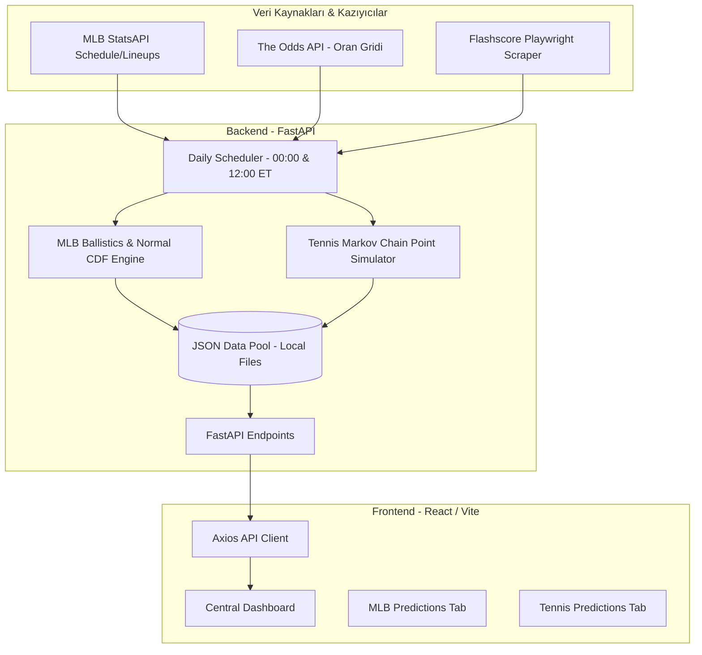

# Legends Sports Platformu — Detaylı Çalışma Sistemi ve İşleyiş Raporu

Bu rapor, Legends Sports tahmin platformunun (MLB ve Tenis motorları) mimari yapısını, yapay zeka entegrasyonlarını, güncelleme döngülerini, mevcut sistem risklerini ve gelecek yol haritasını özetleyen kapsamlı bir çalışma sistemi dokümanıdır.

---

## 🧭 1. Sistem Mimarisi ve Veri Akışı (Nasıl Çalışıyor?)

Platform, backend'in veri toplayıp hesaplama yapması ve frontend'in bu sonuçları dinamik olarak sunması üzerine kurulu **Decoupled (Ayrık)** bir yapıya sahiptir.

### A. Sitenin Canlılığı Nasıl Sağlanıyor? (Güncelleme Döngüleri)
Sistemde API kotası ve performans tasarrufu amacıyla **"On-Demand Scraping" (Kullanıcı girdikçe kazıma yapma) YASAKTIR**. Sitenin güncellenmesi şu şekilde işler:

1.  **Zamanlanmış Görevler (Scheduler):** Backend içerisinde çalışan zamanlayıcı (`scheduler.py`), her gün **Doğu Saati (ET) ile 00:00 ve 12:00'de** otomatik olarak tetiklenir.
2.  **Veri Toplama:** 
    *   **MLB:** Günlük fikstür StatsAPI'den çekilir; hava durumu verileri stadyum konumlarına göre alınır; bahis oranları *The Odds API* üzerinden toplanır.
    *   **Tenis:** Günlük maçlar ve dünün biten set skorları Playwright tabanlı kazıyıcılar yardımıyla *Flashscore* üzerinden taranır.
3.  **Hesaplama ve Cache:** Modeller çalıştırılır, tahminler üretilir ve sonuçlar statik JSON dosyaları olarak diske kaydedilir (`todays_predictions.json`, `today_predictions.json`).
4.  **Arayüz Sunumu:** Kullanıcı siteye girdiğinde backend herhangi bir API sorgusu yapmaz veya kazıyıcı tetiklemez. Doğrudan diskteki hazır JSON verilerini saniyeler içinde frontend'e servis eder.

---

## 🧠 2. Yapay Zeka ve Tahmin Modellerinin Çalışma Mantığı

### A. Yapay Zeka ve Dil Modeli (LLM) Entegrasyonu: Groq ve Gemini Durumu
*   **Mevcut Durum (Groq Free Tier):** Sistemde şu an aktif bir Google Gemini API anahtarı bulunmamaktadır. Model analizleri, maç yorumları ve sabermetrik özetler (AI Insights) **Groq Free Tier** üzerinden (LLaMA/Mixtral modelleri kullanılarak) ücretsiz planla üretilmektedir.
*   **Groq Sınırları ve Riskleri:** Groq'un ücretsiz planı çok katı **Rate Limit (RPM/TPM - Dakika başına istek ve token sınırı)** kurallarına sahiptir. Günde 15+ beyzbol maçı ve onlarca tenis karşılaşması için aynı anda analiz üretilmeye çalışıldığında, Groq API'si `429 Too Many Requests` hatası döndürür. Bu durumlarda sistem çökmeyerek önceden kodlanmış *statik şablon analizleri* devreye sokar.

### B. MLB Tahmin Motoru (V8 Engine)
MLB modeli, salt istatistik karşılaştırmasının ötesinde sabermetrik ve fiziksel faktörleri birleştirir:
1.  **Ballpark Ballistics (Stadyum Balistiği):** Maçın oynanacağı stadyumun rakımı, o günkü hava sıcaklığı, nem oranı ve rüzgar hızı/yönü hesaplanır. Bu veriler, uçan topların (flyball) havada kat edeceği mesafeyi etkileyerek maçtaki toplam sayı (O/U) beklentisini %18'e kadar manipüle edebilir.
2.  **Normal CDF Spread Olasılıkları:** Atıcıların (Pitcher) ve vurucuların (Batter) matchup analizlerinden elde edilen tahmini sayı farkları, standart sapması $4.0$ olan normal bir **Kümülatif Dağılım Fonksiyonu (CDF)** eğrisine sokulur. Bu eğri, handikap kapama olasılığını matematiksel olarak hesaplar.
3.  **NRFI/YRFI Modeli:** İlk inning'de sayı olup olmayacağını tahmin etmek için ilk tur vurucularının Strikeout (K%) / Walk (BB%) oranları ile başlangıç atıcısının ilk inning performansları çarpılarak lojistik bir olasılık üretilir.

### C. Tenis Tahmin Motoru (Markov Point Chain)
Tenis tahminleri, oyuncuların geçmiş maçlardaki servis ve karşılama verilerini kullanır:
1.  **Girdi Metrikleri:** Oyuncuların zemin bazında (Hard, Clay, Grass) servis tutma (Hold %) ve servis kırma (Break %) olasılıkları hesaplanır.
2.  **Markov Zinciri Simülasyonu:** Maçtaki her bir puan (point) olasılık dağılımıyla simüle edilir. Puan olasılıkları oyunları (game), oyunlar setleri, setler ise maçı kazanma olasılığını belirler. Model, her maç için point-by-point seviyesinde 10,000 kez simülasyon çalıştırarak set skorları ve toplam oyun alt/üst limit olasılıklarını üretir.

---

## 📂 3. Mevcut Eksikler ve Yarım Kalan Çalışmalar

1.  **NBA Tahmin Motoru (BETA):**
    *   *Arayüz Durumu:* Navigasyonda ve anasayfa kartında `BETA` olarak listelenmektedir ve tıklanabilir durumdadır.
    *   *Backend Durumu:* NBA için herhangi bir otomatik veri kazıyıcı (scraper), ELO veri tabanı veya aktif tahmin üreten model entegrasyonu backend tarafında bulunmamaktadır. Tamamen boştur.
2.  **Soccer & UFC Tahmin Motorları (COMING SOON):**
    *   *Durum:* Arayüzde tıklanamaz kartlar olarak yer almaktadır. UFC için dövüşçü istatistik havuzunun toplanması ve ELO formüllerinin kurulması planlama aşamasındadır.
3.  **Arşivlenmiş Geçmiş Veriler:**
    *   *Durum:* Dünün ve geçmiş günlerin tahminleri dinamik olarak diskteki arşiv klasöründen (`predictions_YYYY-MM-DD.json`) okunmaya çalışılmaktadır. Ancak geçmişe dönük verilerin düzenli tutulması ve temizlenmesi için backend tarafında otomatik bir arşiv temizlik/sıkıştırma rutini eksiktir.

---

## ⚡ 4. Kritik Riskler ve Dikkat Edilmesi Gereken Durumlar

> [!CAUTION]
> ### 1. Playwright Kazıyıcısının Flashscore Tarafından Engellenme Riski (Tenis)
> Tenis verileri Playwright ile Flashscore'un canlı sayfalarından kazınmaktadır. 
> *   Flashscore arayüzündeki en ufak bir class/id değişimi kazıyıcıyı bozabilir.
> *   Render gibi bulut platformlarının statik IP adresleri Flashscore'un Cloudflare korumasına takılabilir. Bu durumda istekler bloklanır ve veri çekilemez.
> *   **Önlem:** İlerleyen aşamalarda tenis için de resmi bir API'ye geçiş veya kazıyıcıda konut tipi proxy (residential proxy) kullanımı gerekebilir.

> [!WARNING]
> ### 2. Render Ücretsiz Tier Uyuma (Hibernation) Sorunu
> API sunucumuz Render'ın ücretsiz paketinde barındırılmaktadır. 
> *   Platforma 15 dakika boyunca istek gelmediğinde backend container'ı uyku moduna geçer.
> *   Uykudayken backend içerisindeki zamanlayıcı (`scheduler.py`) durabilir ve gece yarısı/öğlen yapılması gereken tahmin güncellemelerini kaçırabilir.
> *   **Önlem:** API'yi canlı tutmak için dışarıdan ücretsiz bir ping servisi (örneğin *cron-job.org*) kurulmalı ve her 10 dakikada bir `/` adresine istek atarak sunucunun uyumasını engellemelidir. Aynı dış servis, zamanlanmış güncellemeleri tetiklemek için `POST /refresh-data` endpoint'ini doğrudan tetikleyebilir.

> [!NOTE]
> ### 3. Groq API Ücretsiz Kota Limiti
> Groq API anahtarının ücretsiz olması nedeniyle güncellemeler esnasında sıklıkla rate limit aşımı yaşanmaktadır. Canlı yayına geçmeden önce mutlaka ücretli bir API anahtarı (Gemini veya Groq) `.env` dosyasına girilmelidir.

---

## 📅 5. Öncelikli Yapılması Gerekenler Yol Haritası

| Öncelik | İş Tanımı | Açıklama |
|:---:|:---|:---|
| **1** | **Canlı Tutma ve Cron Kurulumu** | Sunucunun uyumasını önlemek ve günlük tahminlerin şaşmadan ET 00:00 ve 12:00'de üretilmesini sağlamak için *Cron-Job.org* entegrasyonunun tamamlanması. |
| **2** | **Ücretli API Anahtarı Entegrasyonu** | Groq rate limit hatalarından kurtulmak ve kaliteli analizler üretmek için ücretli bir yapay zeka API anahtarının sisteme tanımlanması. |
| **3** | **Tenis Kazıyıcı Hata Yönetimi** | Playwright kazıyıcısının çökme durumlarında (Flashscore engeli vb.) tenis arayüzünün boş kalmaması için en azından dünün tahminlerini veya son geçerli verileri gösterecek bir backend fallback yapısının kurulması. |
| **4** | **NBA (BETA) Geliştirilmesi** | Sıradaki spor dalı olan NBA tahmin motorunun (takım ELO'ları ve maç simülatörü) backend tarafında sıfırdan inşa edilip entegre edilmesi. |
