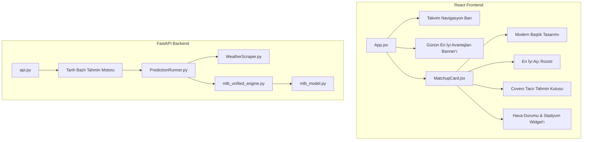

# Milestone 3 - Teknik Uygulama Yol Haritası ve Mimarisi (Roadmap)

MLB Tahmin Motoru modernizasyonunun **Milestone 3 (M3)** aşamasına hoş geldiniz! Bu yol haritası, Tyler'ın talep ettiği **7 Lansman Özelliğini** hayata geçirmek için gereken mimari değişiklikleri, veritabanı eşlemelerini, matematiksel formülleri ve görsel tasarımları detaylandırmaktadır.

Tüm bu özellikleri **0 TL devam eden API maliyetiyle**, yerel matematiksel/fiziksel hesaplamaları ve mevcut ücretsiz veri toplama altyapımızı kullanarak hayata geçirecek akıllı bir strateji tasarladık.

---

## 🗺️ Mimari Genel Bakış ve Servis Analizi

### 1. Yeni arka plan servislerine veya ücretli API'lere ihtiyacımız var mı?
**Hayır, yeni hiçbir üçüncü taraf ücretli servise veya API'ye ihtiyaç yoktur.** Mevcut altyapımız tüm gereksinimleri karşılamak için fazlasıyla yeterlidir:
* **Hava Durumu ve Pusulalar (M3-1)**: `WeatherScraper.py` içinde **Open-Meteo API (Ücretsiz)** üzerinden gerçek zamanlı saatlik hava durumunu (sıcaklık, rüzgar hızı, rüzgar yönü, nem) zaten çekiyoruz. Bu verileri yerel bir fiziksel balistik modeliyle işleyerek topun havada süzülme mesafesini ve skora etkisini yerel olarak hesaplayacağız.
* **Spread Olasılığı (M3-6)**: Modelin skor farkı tahminlerine ve geçmiş standart sapma değerlerine dayanan kümülatif normal dağılım eğrileri kullanılarak tamamen backend üzerinde matematiksel olarak hesaplanacaktır.
* **Takvim ve Geçmiş Veriler (M3-7)**: Herhangi bir tarih için maçları, muhtemel atıcıları ve gerçek nihai skorları çekebilen, tamamen ücretsiz ve sınırsız olan resmi **MLB StatsAPI Schedule** (`https://statsapi.mlb.com/api/v1/schedule`) servisi sorgulanarak çözülecektir.

### 2. Dosya Modülerliği ve Güncellenecek Kod Kütüphaneleri



* **Güncellenecek Backend Dosyaları**:
  * [api.py](file:///c:/Users/ozzenc/Desktop/mlb_predictor_engine_v2/backend/app/api/v1/api.py): `/predictions?date=YYYY-MM-DD` sorgu yollarını açmak ve geçmiş tarih önbellek (cache) yönetimini gerçekleştirmek.
  * [prediction_runner.py](file:///c:/Users/ozzenc/Desktop/mlb_predictor_engine_v2/backend/app/services/prediction_runner.py): Herhangi bir tarih için tahminlerin dinamik olarak çalıştırılmasını desteklemek ve hava durumu faktörlerini tahmin motoruna beslemek.
  * [mlb_unified_engine.py](file:///c:/Users/ozzenc/Desktop/mlb_predictor_engine_v2/backend/app/services/mlb_unified_engine.py): Hava durumu metriklerini skor tahminlerine enjekte etmek ve Spread Olasılığı hesaplamalarını çalıştırmak.
  * [mlb_model.py](file:///c:/Users/ozzenc/Desktop/mlb_predictor_engine_v2/backend/app/models/mlb_model.py): Balistik top taşıma mesafesi katsayılarını hesaplamak; runs, HR ve K beklentilerini ayarlamak.
* **Güncellenecek Frontend Dosyaları**:
  * [App.jsx](file:///c:/Users/ozzenc/Desktop/mlb_predictor_engine_v2/frontend/src/App.jsx): En üste kaydırılabilir Takvim Navigasyon barını eklemek, tarih bazlı veri çekmeyi tetiklemek ve Günün En İyi Avantajları (Daily Edges) Banner'ını yerleştirmek.
  * [usePredictions.js](file:///c:/Users/ozzenc/Desktop/mlb_predictor_engine_v2/frontend/src/hooks/usePredictions.js): Seçilen tarihleri dinamik olarak çekmek için isteğe bağlı bir `date` parametresi kabul etmek.
  * [MatchupCard.jsx](file:///c:/Users/ozzenc/Desktop/mlb_predictor_engine_v2/frontend/src/components/MatchupCard.jsx): Standout Headliner, En İyi Açı Rozeti, Covers Tarzı Kutu ve etkileşimli Hava Durumu Stadyum Pusulasını uygulamak.

---

## 📊 M3 Yol Haritası: Görev Sınıflandırması ve Teknik Detaylar

Tüm 7 lansman görevini **En Kolaydan (Görsel/CSS)** **En Zora (Karmaşık Matematik & Tarih Rotaları)** doğru sınıflandırdık:

---
(YAPILDI)
### Görev 1: Standout Headliner Redesign (Modern Başlık Tasarımı)
> **Zorluk**: 🟢 **KOLAY (Görsel / CSS)**  
> **Bileşen**: `MatchupCard.jsx` (Header bölümü)

* **Hedef**: Mevcut sade maç başlığı çubuğunu, her iki takım logosunu, isimlerini ve maç durumunu zarif, mobil uyumlu ve yüksek kontrastlı bir tasarımla vurgulayan şık bir banner ile değiştirmek.
* **UI/UX Geliştirmeleri**:
  * İnce metalik sınırlara sahip parlak cam morfizmi arka planı (`border-slate-700/80 bg-slate-900/60`).
  * Takımların renklerini temsil eden şık, parlayan neon çizgiler.
  * Net maç durumu göstergeleri (örn. dinamik canlı yanıp sönen yeşil ışık veya tamamlanmış maç skoru rozeti).
  * `320px` kadar dar ekranlarda bile elemanların kaymasını önleyen ve okunabilirliği koruyan mobil uyumlu ızgara (grid) yerleşimi.

---
(YAPILDI)
### Görev 2: Best Angle Indicator (En İyi Açı Rozeti)
> **Zorluk**: 🟢 **KOLAY (Veri Mantığı)**  
> **Bileşen**: `MatchupCard.jsx` & `mlb_unified_engine.py`

* **Hedef**: Bir maç için tüm bahis pazarlarını taramak, bahis bürosu oranlarına kıyasla en yüksek mutlak avantaja (edge) sahip olan seçeneği belirlemek ve kartın üzerine özel bir hedef rozeti basmak (örn. `BEST ANGLE: NRFI (%68 Güven)` veya `BEST ANGLE: Away ML (+155, %6.2 Edge)`).
* **Teknik Plan**:
  * Moneyline avantajlarını (`away_edge_pct`, `home_edge_pct`), F5 avantajlarını, Over/Under avantajlarını ve NRFI/YRFI güven seviyelerini karşılaştırın.
  * Bahis bürosuna kıyasla en yüksek pozitif avantaja sahip olan veya en yüksek matematiksel güveni veren (örn. yüksek olasılıklı NRFI) pazarı seçin.
  * Kullanıcının gözünü anında yakalamak için bu öneriyi her maç kartının sağ üst köşesindeki parlayan neon bir hedef kutusunun içinde gösterin.

---
(YAPILDI)
### Görev 3: Covers-Style Predictions Box (Covers Tarzı Tahmin Kutusu)
> **Zorluk**: 🟡 **ORTA (Mantık ve Çeviri)**  
> **Bileşen**: `MatchupCard.jsx` (Özet alanı)

* **Hedef**: Ondalık skor tahminlerinin yarattığı zihinsel yükü ortadan kaldırmak ve modelin nihai konsensüs seçimlerini profesyonel bahis sitelerinde (Covers veya Action Network gibi) kullanılan standart bahis formatında sunmak.
* **UI/UX Tasarımı**:
  * 3 sütunlu yapılandırılmış bir kutu sunun:
    1. **Moneyline Konsensüsü**: Örn., `CHC ML` (öngörülen kazanma ihtimaliyle birlikte, örn. `%58`).
    2. **Spread Seçimi**: Örn., `HOU +1.5` (öngörülen spread kapama ihtimaliyle birlikte, örn. `%64`).
    3. **Total (Over/Under)**: Örn., `OVER 8.5` (öngörülen toplam sayı beklentisiyle birlikte, örn. `9.8 Runs`).
  * Kalın kontrastlı sayılar ve renkli göstergeler kullanın (ana tercihler için Yeşil, ikincil eğilimler için Mavi).

---

(YAPILDI)
### Görev 4: Board / Daily Edges Banner (Günün En İyi Avantajları Banner'ı)
> **Zorluk**: 🟡 **ORTA (Agregasyon & Arayüz)**  
> **Bileşen**: `App.jsx` (Hero alanı)

* **Hedef**: Günün tüm maç listesini taramak ve tüm fikstür genelindeki en yüksek değerli 3 tahmini anasayfanın en üstünde yatay parıldayan bir şerit halinde vurgulamak.
* **Teknik Plan**:
  * **En İyi Moneyline Avantajı**: `max(away_edge_pct, home_edge_pct)` değerine sahip en yüksek maç.
  * **En İyi Spread Avantajı**: En yüksek spread kapama olasılığına sahip maç.
  * **En İyi Total (O/U) Avantajı**: Modelin toplam sayı tahmini ile bahis bürosunun limiti arasında en yüksek farka sahip olan maç.
  * **Arayüz**: Bunları en üstte, Tyler'ın "VIP / En İyi Seçimler" vitrini olarak hizmet veren üç yüksek kontrastlı parlayan mikro kart olarak görüntüleyin.

---

(YAPILDI)
### Görev 5: Spread Probability Formula (Spread Olasılık Formülü)
> **Zorluk**: 🟡 **ORTA (Matematik)**  
> **Bileşen**: `mlb_unified_engine.py` & `mlb_model.py`

* **Hedef**: Standart bir $\pm 1.5$ sayı spreadinin kapama olasılığını kesin matematiksel yüzde olarak hesaplayacak backend güncellemesini yapmak.
* **Matematiksel Formül**:
  * Beyzbol skor farkları yaklaşık olarak bir Normal Dağılım izler: $X \sim \mathcal{N}(\mu, \sigma^2)$ burada $\mu = \text{Ev Sahibi Skor} - \text{Deplasman Skor}$ ve modern MLB skorlama standart sapması $\sigma \approx 4.0$ runs'dır.
  * Ev sahibinin 2 veya daha fazla sayı farkla kazanma (sayı handikapı -1.5 kapama) olasılığı:
    $$P(X \ge 1.5) = 1 - \Phi\left(\frac{1.5 - \mu}{4.0}\right)$$
  * Ev sahibinin +1.5 spread kapama (1 sayıyla kaybetme, berabere bitme veya kazanma) olasılığı:
    $$P(X \ge -1.5) = 1 - \Phi\left(\frac{-1.5 - \mu}{4.0}\right)$$
  * Bu formülü Python'un `math.erf` fonksiyonunu kullanarak **Kümülatif Dağılım Fonksiyonunu** ($\Phi$) ağır paketlere (scipy vb.) ihtiyaç duymadan hesaplayacağız:
    ```python
    def standard_normal_cdf(x: float) -> float:
        return 0.5 * (1.0 + math.erf(x / math.sqrt(2.0)))
    ```
  * Hesaplanan yüzdeler (örn. `%62.5`) API verisiyle taşınacak ve arayüzde CountUp ile canlandırılacaktır.
---

(YAPILDI)
### Görev 6: Weather Impact Engine & UI (Hava Durumu Etki Motoru)
> **Zorluk**: 🔴 **ZOR (Fizik Modeli & Grafikler)**  
> **Bileşen**: `mlb_model.py` (Fizik formülleri) & `MatchupCard.jsx` (Stadyum Arayüzü)

* **Hedef**: Ballistik top süzülme mesafesi fizik modelini kurarak, stadyum rakımı, sıcaklık, nem ve rüzgar yönü vektörlerine göre runs, HR ve K beklentilerini **0 TL API maliyetiyle** yerel olarak modifiye etmek.
* **Fizik Formülleri**:
  * **Hava Yoğunluğu ($\rho$) Etkisi**: Hava yoğunluğu irtifa, yüksek sıcaklık ve yüksek nem ile azalır; bu da top üzerindeki aerodinamik sürtünmeyi (drag) azaltır.
    * Temel Havada Süzülme Mesafesi Katsayısı:
      $$\text{Süzülme}_{\text{temel}} = (\text{Temp} - 72) \cdot 0.35 + (\text{Stadyum Rakımı}) \cdot 0.005 - (\text{Nem} - 50) \cdot 0.05$$
  * **Rüzgar Vektörünün İzdüşümü**: Rüzgar hızını ($W$), rüzgar yönü ($\theta_w$) ve stadyumun merkez saha açısına ($\theta_c$) göre izdüşürün:
    * Karşı Rüzgar / Arka Rüzgar Bileşeni:
      $$W_{\text{out}} = W \cdot \cos(\theta_w - \theta_c)$$
    * Yan Rüzgar Bileşeni:
      $$W_{\text{cross}} = W \cdot \sin(\theta_w - \theta_c)$$
  * **Birleşik Havada Süzülme Mesafesi Değişimi**:
      $$\Delta \text{Mesafe (ft)} = \text{Süzülme}_{\text{temel}} + W_{\text{out}} \cdot 1.8$$
  * **Skor Çarpanları**:
    * Runs Çarpanı: $1.0 + (\Delta \text{Mesafe}) \cdot 0.003$
    * HR Çarpanı: $1.0 + (\Delta \text{Mesafe}) \cdot 0.007$
    * Strikeout Çarpanı: Yüksek rüzgar ve soğuk parmak tutuşunu zorlaştırarak spin oranını azaltır; nem breaking ball hareketini sönümler.
* **Premium UI**:
  * Rüzgar vektörünün beyzbol sahasına nasıl çarptığını gösteren etkileşimli bir **Stadyum Pusulası (SVG)**.
  * Dijital telemetri ekranı:
    * `⚾ Top Taşıma: +14.2 ft (Güçlü Arka Rüzgar)`
    * `🔥 Home Runs: +%11 HR Olasılığı`
    * `📉 Atıcı Tutuşu: -%4 K (Yüksek Nem)`

---
(YAPILDI)
### Görev 7: Historical Match Results & Calendar Navigation (Tarihsel Sonuçlar ve Takvim)
> **Zorluk**: 🔴 **ZOR (Karmaşık Rotalar, Önbellekleme & StatsAPI Entegrasyonu)**  
> **Bileşen**: `api.py`, `prediction_runner.py`, `App.jsx`

* **Hedef**: Anasayfanın en üstünde, kullanıcıların Dün, Bugün veya Yarın'ı seçmelerine olanak tanıyan, dünkü skor sonuçlarını ve yarının projeksiyonlarını anında gösteren yatay bir takvim barı oluşturmak.
* **Teknik & Önbellek Planı**:
  * Backend API rotasını `/predictions?date=YYYY-MM-DD` parametresini destekleyecek şekilde genişletmek.
  * Geçmiş bir tarih (Dün) istendiğinde:
    1. `backend/data` klasöründe `predictions_YYYY-MM-DD.json` dosyasını arayın.
    2. Eğer **önbellekte yoksa**:
       * StatsAPI schedule servisini o tarih için çağırın: `https://statsapi.mlb.com/api/v1/schedule?sportId=1&date=YYYY-MM-DD&hydrate=probablePitcher`.
       * Bu servis hem dünkü maçları, atıcıları hem de **gerçek tamamlanmış final skorlarını** (örn. CHC 5, HOU 2) dönecektir.
       * Matematik motorumuzu (`MLBUnifiedEngine`) bu maçlar üzerinde çalıştırıp tahminleri anında hesaplayın ($<100\text{ms}$ sürer).
       * Tahminlerimiz ile StatsAPI'den gelen gerçek skorları eşleştirin.
       * Bir sonraki yüklemede anında açılması için `predictions_YYYY-MM-DD.json` olarak diske kaydedin.
  * Gelecek bir tarih (Yarın) istendiğinde: Fikstürü çekin, tohumlu bahis oranları ve matematik motoruyla tahminleri üretip diske kaydedin.
* **Arayüz Özellikleri**:
  * Yatay takvim şeridi: `[ DÜN (24 Mayıs) ]  [ BUGÜN (25 Mayıs) ]  [ YARIN (26 Mısıs) ]`.
  * Dünün tamamlanan maçları için **Model vs Gerçek Sonuç Karşılaştırma rozetleri**:
    * Tahmin: `4.5 - 3.2` | Gerçek Skor: `5 - 3` ➔ Rozet: `✅ Tahmini Kazanan İsabetli!`
    * Tahmin: `OVER 7.5` | Gerçek Toplam: `8 Runs` ➔ Rozet: `✅ Toplam Sayı (Over) İsabetli!`
    * Bu, modelin başarısını ve doğruluğunu görsel olarak kanıtlayacak en büyük **güven/prestij unsuru** olacaktır.

---

---
(YAPILDI)
### Görev 8: Pregame Odds Freeze (Maç Öncesi Oran Sabitleme)
> **Zorluk**: 🟢 **KOLAY (Arayüz Düzenleme)**  
> **Bileşen**: `MatchupCard.jsx`, `client.js`

* **Hedef**: Canlı veya tamamlanmış maçlarda dinamik olarak değişen canlı oranlar yerine, maç başlamadan hemen önceki **Pregame Closing (Kapanış) Oranlarını** arayüzde sabitlemek.
* **Teknik Plan**:
  * Maç kartlarında oran verisini çekerken eğer maç başlamışsa (`Live` veya `Final`), API'den gelen canlı ML (Moneyline) oran güncellemelerini yansıtmak yerine backend'de kaydedilen son maç öncesi oran verisini (`pregame_home_ml`, `pregame_away_ml`) kilitlemek.

---
(YAPILDI)
### Görev 9: Consensus Edges Lock (Günün En İyi Avantajları Sabitleme)
> **Zorluk**: 🟡 **ORTA (Önbellek & Memoization)**  
> **Bileşen**: `api.py`, `App.jsx`, `prediction_runner.py`

* **Hedef**: Sayfanın en üstünde yer alan Günün En İyi Avantajları (Consensus Edges) listesindeki en iyi 3 oyunun gün içinde maçlar oynandıkça veya oranlar dalgalandıkça yer değiştirmesini/güncellenmesini engellemek. Sabah ne belirlendiyse gün boyu sabit kalmasını sağlamak.
* **Teknik Plan**:
  * Günlük tahminler ilk kez oluşturulup diske yazıldığında (`predictions_YYYY-MM-DD.json`), o günün en iyi consensus edges listesini de bu dosyanın içine bir anahtar (`consensus_edges`) olarak kaydedeceğiz.
  * API üzerinden veriyi çekerken her istekte dinamik hesaplamak yerine, dosyanın içindeki bu kilitli listeyi sunarak gün boyu kararlılığı koruyacağız.

---
(YAPILDI)
### Görev 10: Consensus Edges Genişletmesi: "Most Confident ML Plays" & "Team Totals to Target"
> **Zorluk**: 🟡 **ORTA (Backend Entegrasyonu & Frontend Tasarımı)**  
> **Bileşen**: `mlb_unified_engine.py`, `App.jsx`

* **Hedef**: Consensus Edges kutusunu genişleterek Tyler'ın talep ettiği 2 yeni premium kategoriyi eklemek:
  1. **Most Confident ML Plays**: Modelin o gün için en yüksek güven yüzdesine sahip 2 galibiyet (Moneyline) oyununu listeleyecek.
  2. **Team Totals to Target**: Kitap çizgileri elimizde tam olmadığı için sabit 4.5 veya 5.0 sayı barajını baz alıp, projeksiyonlarda bu barajın çok üzerinde (örn. 5.8 runs, 6.2 runs) sayı atması beklenen en güvenilir 2 takımı hedef gösterecek.
* **Teknik Plan**:
  * `mlb_unified_engine.py` içinde o günkü tüm takımların `projected_runs` değerlerini inceleyeceğiz. Takım sayı beklentisi > 4.5/5.0 olan ve modelin en yüksek güvende olduğu iki takımı filtreleyip `team_totals` olarak consensus yapısına ekleyeceğiz.
  * Arayüze bu yeni iki başlık için şık, neon tasarımlı yeni bilgi kartları ekleyeceğiz.

---
(YAPILDI)
### Görev 11: NRFI/YRFI 70%+ Crown Badge (👑 Taç Rozeti)
> **Zorluk**: 🟢 **KOLAY (Görsel / CSS)**  
> **Bileşen**: `MatchupCard.jsx` (NRFI Modeli Sekmesi)

* **Hedef**: Tyler'ın asıl takip edeceği ve kaydını tutacağı **%70 ve üzeri** güven skoruna sahip premium NRFI/YRFI tahminlerinin yanına özel bir taç (**👑**) emojisi yerleştirmek.
* **Teknik Plan**:
  * `MatchupCard` içerisindeki NRFI listelemesinde, confidence skoru `>= 0.70` (veya `%70`) ise ilgili maçın yanına parlayan bir taç rozeti ekleyeceğiz.

---
(YAPILDI)
### Görev 12: Vegas O/U <= 8.0 NRFI Boost (Matematiksel Güncelleme)
> **Zorluk**: 🟡 **ORTA (Matematik / Tahmin Motoru)**  
> **Bileşen**: `mlb_unified_engine.py`

* **Hedef**: Eğer bahis bürolarının belirlediği toplam sayı limiti (Vegas Over/Under) **8.0 veya daha düşükse**, bu durum zaten az skorlu bir maç beklentisini kanıtladığı için modelin NRFI güven skoruna otomatik bir destek (boost) katsayısı eklemek.
* **Matematiksel Formül**:
  * Vegas O/U limitini ($OU$) kontrol edeceğiz. Eğer $OU \le 8.0$ ise, NRFI güven skoruna ($C_{\text{nrfi}}$) Vegas katsayısı ekleyeceğiz:
    $$C_{\text{nrfi\_boosted}} = C_{\text{nrfi}} + (8.5 - OU) \cdot 0.02$$
  * Böylece limit 8.0 olduğunda $+0.01$ (%1), limit 7.0 olduğunda ise $+0.03$ (%3) ek güven puanı doğrudan formüle yansıtılacak.

---

(YAPILDI)
### Görev 13: "Weakest-Link Penalty" (David Peterson Zayıf Atıcı Cezalandırması)
> **Zorluk**: 🔴 **ZOR (İstatistiksel Agregasyon Algoritması)**  
> **Bileşen**: `mlb_unified_engine.py`

* **Hedef**: David Peterson örneğinde olduğu gibi, atıcılardan birinin bile L10 (Son 10 maç) NRFI hit rate'i berbat durumdaysa (örn. < %50), diğer atıcı ne kadar iyi olursa olsun o maçı en üst sıralardan aşağıya süpürmek (cezalandırmak).
* **Matematiksel Formül**:
  * Mevcut sistemde iki atıcının yüzdeleri toplanıp basitçe ortalanıyorsa, bu durum Chase Burns (%100) ile David Peterson (%40) birleştiğinde ortalamayı yanıltıcı şekilde %70 seviyelerine çıkarıyordu.
  * Bunu çözmek için **"Zayıf Halka Cezası" (Weakest-Link Penalty - $P_{\text{weak}}$)** katsayısını entegre edeceğiz:
    * İki atıcının L10 yüzdelerini karşılaştır: $P_{\text{min}} = \min(SP_1, SP_2)$
    * Eğer $P_{\text{min}} < 0.50$ (yani atıcılardan biri yarı yarıyadan daha az NRFI yapıyorsa), toplam skora ceza uygula:
      $$C_{\text{nrfi\_final}} = C_{\text{nrfi}} \cdot (1.0 - (0.50 - P_{\text{min}}) \cdot 0.6)$$
    * *Örnek*: Bir atıcı %40 ise ($P_{\text{min}} = 0.40$), ceza çarpanı: $1.0 - (0.10 \cdot 0.6) = 0.94$ (Skor %6 oranında doğrudan cezalandırılır ve geriye düşer). Atıcı %30 ise ceza çarpanı $0.88$ (%12 ceza) olur.
  * Bu sayede tek yönlü zayıf atıcıya sahip hiçbir maç en üst sıradaki taçlı premium maçlar arasına giremeyecektir.

---

## 🏁 Uygulama ve Faz Planı

M3 aşamasında 1-7. görevler başarıyla tamamlanmıştır. Tyler'ın geri bildirimleri doğrultusunda **Faz 6 (M3.5 Cilalaması)** süreci eklenmiştir:

1. **Aşama 1-5 [TAMAMLANDI]**: 1-7. Lansman Görevlerinin backend balistik motoru, stadyum pusulası SVG'si, normal CDF handikap hesaplayıcısı, takvim navigasyonu, covers kutuları ve Render cold-start UX geliştirmeleri tamamlanmış ve canlıya basılmıştır.
2. **Aşama 6 [YENİ - M3.5 Cilalaması]**: Tyler'ın talepleri olan 8-13. Görevlerin (Pregame odds freeze, consensus edges lock, team totals & most confident ML plays, taç emojisi, Vegas O/U boost formülü ve weakest-link atıcı cezalandırması) backend/frontend implementasyonlarının tamamlanması ve test edilmesi.
3. **Aşama 7 [Final Onay]**: Cilalanmış M3.5 sürümünün derlenip canlıya basılarak Tyler'ın onayına sunulması.
