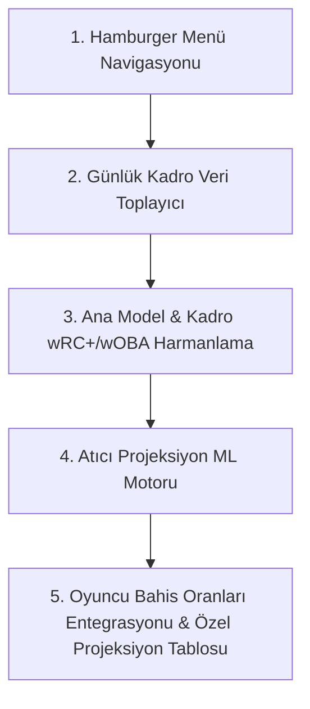

# MLB Predictor Engine - Milestone 4 & 5 Güncellenmiş Yol Haritası ve Mimarisi

Tyler'ın 120$'lık yeni mikro yükseltme (small upgrade) planını onaylamasının ve paylaştığı el yazısı notların ardından, geliştirme kapsamı ve yol haritası güncellenmiştir. 

Sitedeki tüm görsel grafikler, hava durumu kartları ve bildirim botları **Milestone 5**'e devredilmiş; Milestone 4 ise tamamen Tyler'ın ilettiği **Atıcı Özel Projeksiyon Modeli (Strikeouts & Outs)**, **Kadro (Lineup) Harmanlama ve Ana Model İyileştirmelerine** odaklanmıştır. Ayrıca bu yeni sayfanın ana ekranı kirletmemesi için navigasyonu sadeleştirecek **Hamburger Menü** de M4 kapsamına alınmıştır.

---

## 🏁 M4: Core Model Extensions & Pitcher Props ML Engine
**Bütçe:** $120  
**Tahmini Süre:** 6-8 Gün  
**Odak:** Hamburger Navigasyon Menüsü, 5 Yeni Model İstatistiği + Kadro Bazlı wRC+/wOBA Harmanlama, Atıcı Projeksiyon ML Modeli (XGBoost/Random Forest), Kadro (Lineup) Kazıma ve Oran Entegrasyonu.

### 📅 Geliştirme ve Uygulama Sıralaması (Sequence of Implementation)

---

### 📂 Detaylı Görev Listesi ve Mimari Değişiklikler

#### Görev 1: Header Dropdown / Hamburger Navigasyon Menüsü
* **Zorluk Seviyesi**: 🟢 **KOLAY (UI/UX Tasarımı)**
* **Geliştirme Sırası**: 1. Sıra
* **Etkilenecek Dosyalar**:
  * [App.jsx](file:///c:/Users/ozzenc/Desktop/mlb_predictor_engine_v2/frontend/src/App.jsx) (Yatay sekmeler kaldırılacak, hamburger entegre edilecek)
  * `frontend/src/components/DropdownNavigation.jsx` [NEW] (Hamburger açılır menü bileşeni)
  * [index.css](file:///c:/Users/ozzenc/Desktop/mlb_predictor_engine_v2/frontend/src/index.css) (Mobil uyumlu hamburger animasyonları)
* **Hedef**: Ana sayfanın karmaşıklaşmasını önlemek adına yatay sekmeleri (Daily Games, NRFI Model, Weather vb.) sağ üst köşede açılır modern bir hamburger menü navigasyonuna taşımak. Bu menüye yeni açılacak "Pitcher Projections" sekmesini eklemek.

#### Görev 2: Günlük Kadro Veri Toplayıcı (Confirmed Lineups Scraper)
* **Zorluk Seviyesi**: 🟡 **ORTA (Veri Kazıma & MLB StatsAPI Entegrasyonu)**
* **Geliştirme Sırası**: 2. Sıra
* **Etkilenecek Dosyalar**:
  * [matchup_scraper.py](file:///c:/Users/ozzenc/Desktop/mlb_predictor_engine_v2/backend/app/services/matchup_scraper.py) (Günlük kadro çekim metodu eklenecek)
  * [prediction_runner.py](file:///c:/Users/ozzenc/Desktop/mlb_predictor_engine_v2/backend/app/services/prediction_runner.py) (Kadro verilerini günlük döngüye dahil edecek)
* **Hedef**: MLB StatsAPI (`/api/v1/game/{gamePk}/boxscore` ve schedule feed'leri) kullanarak günlük onaylı 9 kişilik başlangıç kadrosunu (Starting Lineup) çeken asenkron bir mekanizma yazmak. Maç öncesi erken saatlerde kadro henüz resmi olarak açıklanmamışsa, takımın son 5 maçtaki en sık kullandığı varsayılan kadroya geri dönme (fallback) mekanizması kurmak.

#### Görev 3: Ana Model Güçlendirmesi ve Kadro Harmanlama (5 Yeni İstatistik + Lineup wRC+/wOBA Blend)
* **Zorluk Seviyesi**: 🟡 **ORTA-ZOR (Algoritma & Matematiksel Modelleme)**
* **Geliştirme Sırası**: 3. Sıra
* **Etkilenecek Dosyalar**:
  * [mlb_model.py](file:///c:/Users/ozzenc/Desktop/mlb_predictor_engine_v2/backend/app/models/mlb_model.py) (5 yeni istatistik ağırlıklara dahil edilecek)
  * [mlb_unified_engine.py](file:///c:/Users/ozzenc/Desktop/mlb_predictor_engine_v2/backend/app/services/mlb_unified_engine.py) (Kadro wRC+/wOBA harmanlama mantığı uygulanacak)
* **Hedef**: Modelin tahmin başarısını en üst düzeye çıkarmak için şu verileri ana projeksiyona entegre etmek:
  1. **Bullpen SIERA:** Rölyef atıcıların beceriye dayalı bağımsız ERA değerleri (geleneksel bullpen ERA'sının yerini alacak).
  2. **HFA (Home Field Advantage):** Ev sahibi takıma verilecek stadyum bazlı esnetilmiş dinamik katsayı.
  3. **Power Ranking (Sonny Moore) Diferansiyeli:** Sonny Moore güç sıralaması farkına göre küçük bir çarpan artışı.
  4. **Pitchers Expected Stats (xERA, xFIP):** Başlangıç atıcılarının şanstan arındırılmış beklenen ERA ve FIP değerleri (%40 SP gücüne yedirilecek).
  5. **Teams Hitting Stats vs Handedness of SP:** Takımların maça çıkacak atıcının el tercihine (Solak/Sağlak) göre tarihsel vuruş istatistikleri (LHP/RHP splits).
  6. **Lineup wRC+ & wOBA Harmanlaması:** Görev 2'de çekilen günlük teyitli başlangıç kadrosundaki 9 oyuncunun bireysel wRC+ ve wOBA ortalamasını alıp, takımın genel sezon ortalamasıyla oranlamak. Önemli bir oyuncunun (Örn: Aaron Judge) dinlendirildiği veya sakat olduğu günlerde takımın hücum gücünü (`offense_rating`) dinamik olarak düşürmek.

#### Görev 4: Atıcı Özel İstatistikleri Makine Öğrenmesi Motoru (Strikeouts & Total Outs)
* **Zorluk Seviyesi**: 🔴 **ZOR (Veri Bilimi & ML Modelleme)**
* **Geliştirme Sırası**: 4. Sıra
* **Etkilenecek Dosyalar**:
  * `backend/app/services/pitcher_props_engine.py` [NEW] (XGBoost/Random Forest tahmin motoru)
  * [prediction_runner.py](file:///c:/Users/ozzenc/Desktop/mlb_predictor_engine_v2/backend/app/services/prediction_runner.py) (Yeni motoru asenkron döngüde tetikleyecek)
* **Hedef**: Tyler'ın el yazısı notlarında yer alan parametrelerle geçmiş 3 yıllık veriler üzerinden eğitilecek bir XGBoost veya Random Forest regresyon modeli kurmak:
  * **Atıcı Özellikleri (Pitcher):** Home/Away K%, CSW%, SwStr%, K-BB%, Putaway%, BB%, Pitches per PA, Avg Batters Faced/Game, Avg IP/Game, Whiff%.
  * **Kadro Özellikleri (Lineup):** Kadrodaki 9 vurucunun vs LHP/RHP K%, Pitches per PA, Oswing%, SwStr%, CSW%, In Zone Contact%, Whiff%, Swing%, BB% değerlerinin ortalaması.
  * **Çevre Koşulları:** Ballpark rüzgar hızı/yönü, sıcaklık ve stadyum balistik katsayısı.
  * Bu verilerle o maça çıkacak başlangıç atıcısının **Strikeout (K)** ve **Total Outs (Alacağı Toplam Out)** sayılarını projekte etmek.

#### Görev 5: Oyuncu Bahis Oranları Entegrasyonu & Özel Projeksiyon Tablosu
* **Zorluk Seviyesi**: 🟡 **ORTA (React Arayüzü & API Entegrasyonu)**
* **Geliştirme Sırası**: 5. Sıra
* **Etkilenecek Dosyalar**:
  * `frontend/src/components/PitcherProjections.jsx` [NEW] (Özel arayüz tablosu ve kartları)
  * [odds_provider.py](file:///c:/Users/ozzenc/Desktop/mlb_predictor_engine_v2/backend/app/services/odds_provider.py) (the-odds-api player props endpoint entegrasyonu)
  * [api.py](file:///c:/Users/ozzenc/Desktop/mlb_predictor_engine_v2/backend/app/api/v1/api.py) (Yeni tahminleri frontend'e servis eden endpoint)
* **Hedef**: Tyler'ın $30'lık planıyla açılacak `player_strikeouts` ve `player_outs` market verilerini çekmek. Modelin bulduğu projeksiyonlar ile büroların limitlerini karşılaştırıp avantajı (Edge) hesaplamak ve şu tabloyu oluşturmak:
  * `Pitcher | Book's K line | Proj K's | O/U/Pass | Total Outs Book line | Total Outs Proj | O/U/Pass | Edge`
  * Avantajlı bahisleri (Edge) yeşil renkli vurgularla ve otomatik karar mekanizmasıyla (OVER/UNDER/PASS) kullanıcıya sunmak.

---

## 🏁 M5: Interactive Ballistics, Graphs & Alerts
**Bütçe:** Sonra Konuşulacak  
**Odak:** weathermlb.com Tarzı Genişleyen Kompakt Liste, Kapanabilir Recharts Stadyum Karşılaştırma Grafikleri, DraftKings -1 Spread Formülü, Telegram & SMS Bildirim Servisi ve Canlı Edges.
