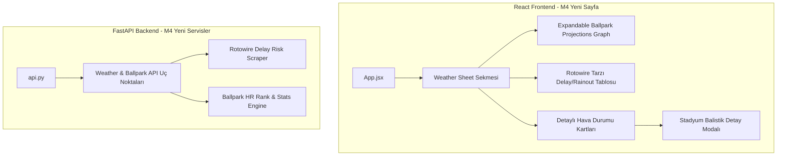

# Milestone 4 - "Weather & Ballpark Telemetry Center" Yol Haritası ve Mimarisi (Roadmap)

Tyler'ın Milestone 3 Lansman sürümünü gördükten sonra paylaştığı vizyoner geri bildirimler doğrultusunda, MLB Tahmin Motoru'nun bir sonraki büyük aşaması olan **Milestone 4 (M4)** planlanmıştır. 

M3'te başlattığımız "Hava Durumu Balistik Motoru v1" alt yapısını kullanarak, bu aşamada uygulamayı profesyonel spor analitiği siteleriyle (Rotowire ve BallparkPal) yarışacak düzeyde bir **Hava Durumu & Stadyum Telemetri Paneli (Dashboard)** seviyesine yükseltmeyi hedefliyoruz.

---

## 🗺️ M4 Mimari Genel Bakış ve Yeni Servisler

M4 özellikleri yepyeni arayüz sayfaları, grafik kütüphaneleri ve ek veri kaynakları gerektirmektedir.

### Güncellenecek ve Yeni Eklenecek Dosyalar:
* **Yeni Backend Modülleri**:
  * `backend/app/services/stadium_telemetry.py` [NEW]: Tüm MLB stadyumlarının HR rank, ortalama HR ve yapısal boyut verilerini (duvar yükseklikleri, boyut katsayıları) saklayan statik/dinamik veri haritası.
  * `backend/app/services/weather_delay_scraper.py` [NEW]: Rotowire veya benzeri açık kaynaklardan günlük Delay/Rainout (erteleme/yağış iptali) olasılıklarını çeken hafif bir kazıyıcı.
* **Yeni Frontend Bileşenleri**:
  * `frontend/src/components/WeatherSheet.jsx` [NEW]: Tüm hava durumu telemetrisinin, gecikme tablolarının ve grafiklerin barındırılacağı ana sekme sayfası.
  * `frontend/src/components/WeatherModal.jsx` [NEW]: "Details" butonuna basıldığında stadyum pusulasını, balistik süzülme mesafelerini ve sıcaklık/nem rüzgar vektörlerini devasa görsellerle gösteren pop-up modal.
  * `frontend/src/components/ExpandableProjGraph.jsx` [NEW]: Recharts veya benzeri hafif bir grafik kütüphanesi kullanarak tüm maçların Runs, Hits, Strikeouts ve HR projeksiyonlarını kıyaslayan interaktif grafik.

---

## 📊 M4 Yol Haritası: Görev Sınıflandırması ve Teknik Detaylar

---

### Görev 1: Weather Sheet Tab & Live Scrolling List (Hava Durumu Sekmesi ve Listesi)
> **Zorluk**: 🔴 **ZOR (Yeni Sayfa Mimarisi ve API Entegrasyonu)**  
> **Bileşen**: `App.jsx`, `WeatherSheet.jsx` [NEW], `api.py`

* **Hedef**: NRFI sayfasında olduğu gibi, "Daily Games" ve "NRFI Model" sekmelerinin hemen yanına **"WEATHER SHEET"** sekmesi eklemek. Bu sekmede o günkü maçları, erteleme risklerine göre sıralı ve kaydırılabilir bir liste halinde sunmak.
* **UI/UX & Rotowire Entegrasyonu**:
  * Sayfa, Rotowire Delay Dashboard'u (Resim 4) örnek alarak maçları 3 ana gecikme riski kategorisinde gruplayacaktır:
    1. 🔴 **Likely Delay / Rainout (İptal/Erteleme Çok Olası)**
    2. 🟡 **Possible Delay / Rainout (İptal/Erteleme Olası)**
    3. 🟢 **Weather Impact Doubtful (Hava Durumu Etkisi Yok/Çok Düşük)**
  * Her maçın yanında saat bilgisi, takımlar, stadyum ismi ve durumunu gösteren modern cam morfizmi satırlar bulunacaktır.

---

### Görev 2: Detailed Weather Telemetry Modals (Detaylı Balistik Modalları)
> **Zorluk**: 🟡 **ORTA (Görsel Tasarım & SVG Animasyonu)**  
> **Bileşen**: `WeatherModal.jsx` [NEW], `MatchupCard.jsx`

* **Hedef**: Weather Sheet üzerindeki veya ana model kartlarındaki her maçın yanına bir **"Details"** butonu eklemek. Bu butona basıldığında, hava durumunun oyuna etkisini mikroskop altına alan zengin görselliğe sahip bir telemetri modalı açılması.
* **Teknik & Tasarım Detayları**:
  * M3'te tasarladığımız rüzgar yönü SVG pusulasını bu modala taşıyıp daha büyük ve animasyonlu hale getireceğiz.
  * Dijital telemetri ekranına ek fizik parametreleri ekleyeceğiz:
    * `🌡️ Sıcaklık & Nem Etkisi: Hava yoğunluğu %3.4 daha düşük (Top taşımayı arttırır)`
    * `💨 Rüzgar Vektörü: Sola doğru 8.5 mph yan rüzgar (Breaking ball spinini bozar)`
    * `📉 Ballistik Özet: Top havada ekstra +12.4 ft süzülür.`

---

### Görev 3: Ballpark HR Rank & Ballpark HR Averages (Stadyum Güç Metrikleri)
> **Zorluk**: 🟡 **ORTA (Veri Eşleme ve Backend)**  
> **Bileşen**: `stadium_telemetry.py` [NEW], `mlb_unified_engine.py`

* **Hedef**: Tyler'ın talebi doğrultusunda, MLB ortalamaları yerine her stadyumun kendine özel **"Home Run Sıralaması (HR Rank)"** ve **"Stadyum Home Run Ortalaması (Ballpark HR Avg)"** verilerini sisteme entegre etmek ve hava durumu kartlarında göstermek.
* **Teknik Plan**:
  * MLB stadyumlarının tarihsel Statcast Park Factor verilerini backend tarafında statik bir eşleme tablosunda (`stadium_telemetry.py`) derleyeceğiz (Örn: Fenway Park: HR Rank #7, HR Factor: 1.12; Citi Field: HR Rank #28, HR Factor: 0.88).
  * Backend, rüzgar balistik hesabını yaparken bu baz stadyum faktörlerini de hesaba katacak ve arayüzde doğrudan `Fenway Park (HR Rank: #7 | HR Avg: 2.4)` şeklinde zengin metrikler yazacaktır.

---

### Görev 4: Expandable Ballpark Projections Graph (Tıklanınca Genişleyen Kıyaslama Grafiği)
> **Zorluk**: 🔴 **ZOR (Grafik Kütüphanesi Entegrasyonu)**  
> **Bileşen**: `ExpandableProjGraph.jsx` [NEW], `WeatherSheet.jsx`

* **Hedef**: BallparkPal (Resim 5) tarzında, sayfanın en üstünde yer alan ve tıklanınca genişleyen interaktif bir karşılaştırma grafiği oluşturmak.
* **UI/UX & Grafik Detayları**:
  * Tüm maçlar yan yana listelenerek her maç için modelimizin öngördüğü:
    * **Projected Home Runs (Öngörülen HR sayıları)**
    * **Projected Hits (Öngörülen Toplam Vuruşlar)**
    * **Projected Strikeouts (Atıcıların Toplam Strikeout Sayıları)**
    * **Projected Runs (Toplam Maç Skoru)**
  * Verilerini yüksek kontrastlı sütun/çizgi grafikler halinde Recharts kullanarak çizeceğiz. Kullanıcı tek bir bakışta günün en çok skor çıkacak veya en çok HR vurulacak stadyumunu grafik üzerinden seçebilecektir.

---

### Görev 5: "Stay Away" Badges & Weather Risk Integration (Kötü Hava Uyarı Sistemi)
> **Zorluk**: 🟡 **ORTA (Mantık & Görsel Uyarılar)**  
> **Bileşen**: `MatchupCard.jsx`, `mlb_unified_engine.py`

* **Hedef**: Maç günü hava koşulları bahis veya oynanış açısından aşırı risk barındırıyorsa (şiddetli rüzgar, fırtına, yoğun yağmur), sistemi ve kullanıcıyı uyaracak otomatik bir sinyal motoru kurmak.
* **Uygulama Planı**:
  * Hava durumu parametreleri (yağış olasılığı > %60 veya rüzgar hızı > 15mph karşı rüzgar) kritik sınırları aştığında, ana model kartında hava durumu widget'ının hemen yanına parlayan kırmızı bir **"⚠️ STAY AWAY - BAD WEATHER RISK"** rozeti basılacak.
  * Bu uyarılar ayrıca Weather Sheet tablosunun en altında bir "Stay Away & Rain Warning Registry" listesi halinde derlenecek.

---

## 🏁 M4 Uygulama ve Faz Planı

Milestone 3.5 (M3 Cilalamaları) tamamlanıp Tyler'dan onay alındıktan sonra Milestone 4 geliştirmesi şu fazlarla başlatılacaktır:

1. **Aşama 1: Stadyum Metrik Veritabanı & Backend Scrapers** (Görev 3, 5). Stadyum Park faktör haritasının backend'e gömülmesi, yağmur riski uyarı mantığının API'ye bağlanması.
2. **Aşama 2: Yeni Weather Sheet Mimarisi** (Görev 1). Frontend üzerinde yeni sayfa sekmesinin açılması ve maçların gecikme/iptal olasılıklarına göre dinamik listelenmesi.
3. **Aşama 3: Recharts Grafik Entegrasyonu** (Görev 4). Günün tüm stadyum projeksiyonlarını kıyaslayan interaktif genişleyebilir grafiklerin çizilmesi.
4. **Aşama 4: Balistik Detay Modalları** (Görev 2). "Details" pop-up ekranının şık, animasyonlu SVG stadyum compass'ı ile süslenmesi.
5. **Aşama 5: Kapsamlı Test & Tyler Lansmanı**. Sistem stabilizasyonu, Render deployment ve Tyler'ın kullanımına sunum.
