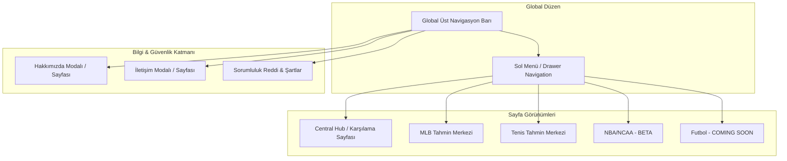

# Milestone 5 - Çoklu Spor Portalı & Arayüz Mimari Yol Haritası (UI/UX Planlama Raporu)

Bu rapor, Legends Sports platformunu tek sporlu (sadece MLB) bir tahmin sayfasından, gelecekte eklenecek yeni spor dallarına (Tenis, Basketbol, Futbol vb.) tam uyumlu, modern navigasyon yapısına sahip profesyonel bir **Çoklu Spor Tahmin Portalı**'na dönüştürme planını sunar.

Koda geçiş yapılmadan önce arayüz mimarisinin, navigasyon hiyerarşisinin ve ölçeklenebilirlik altyapısının planlanması hedeflenmiştir.

---

## 🗺️ 1. Genel Mimari Vizyon: Tek Sayfadan Portala Geçiş

Mevcut MLB tahmin sayfamız tek bir amaca hizmet eden şık bir "landing page" görünümündedir. Siteyi gerçek bir spor portalına dönüştürmek için **3 Katmanlı Hiyerarşi** kuracağız:



---

## 🧭 2. Navigasyon ve Spor Seçim Arayüzü Tasarımı

Gelecekte sisteme 4-5 farklı spor dalı ekleneceği için üst barda yatay sekmeler kullanmak mobil ekranlarda taşmalara neden olacaktır. Bu yüzden aşağıdaki navigasyon sistemini uygulayacağız:

### A. Global Header & Üst Navigasyon Barı (Global Navbar)
Sitede sürekli sabit kalacak (Sticky) üst bar şu bileşenleri içerecektir:
1.  **Sol Bölüm**: Marka Logosu (Legends Sports) ve tıklanabilir "Home" yönlendirmesi.
2.  **Orta Bölüm (Masaüstü)**: Ana sekmeler (Home, MLB, Tennis, NBA `BETA`).
3.  **Sağ Bölüm**: 
    *   **Canlı Sistem Durumu (System Status)**: API bağlantısını ve son veri güncelleme zamanını gösteren minik neon nokta.
    *   **Bilgi Menüsü (Info Menu)**: "About" (Hakkımızda), "Contact" (İletişim) ve "Disclaimers" (Yasal Uyarı) alanlarına hızlı erişim sağlayan bir buton grubu.
    *   **Mobil Menü (Hamburger)**: Mobil cihazlarda tüm bu sekmeleri ve bilgi sayfalarını dikey açılır bir çekmecede (Drawer) toplayacak buton.

### B. Mobil Öncelikli Hamburger Menü (Drawer / Sidebar)
Mobil ekranda hamburger menüye tıklandığında ekranın sağından kayarak açılan şık bir dikey menü tasarlanacaktır:
*   **Aktif Sporlar**: MLB, Tennis (Yanlarında yeşil neon ikonlar).
*   **Beta/Yolda Olan Sporlar**: NBA/NCAA (`BETA` rozetli), NFL, Soccer (`COMING SOON` rozetli, tıklanamaz).
*   **Alt Menü Linkleri**: About, Contact Us, Terms & Disclaimers.

---

## 🏠 3. Mock Ana Sayfa (Central Hub / Karşılama Sayfası) Yapısı

Kullanıcı siteye girdiğinde doğrudan MLB maçlarını görmek yerine, platformun genel kapasitesini ve o günkü en önemli fırsatları sunan bir **Central Hub** ile karşılaşacaktır. 

Bu mock ana sayfa şu dikey bloklardan oluşacaktır:

### Blok 1: Spotlight (Featured Edge of the Day)
*   **Tasarım**: Covers.com tarzında, o gün tüm aktif sporlar (MLB, Tenis vb.) genelinde modelin yakaladığı en yüksek Edge (bahis bürosuna kıyasla en büyük matematiksel avantaj) oranına sahip tek bir maç, sayfanın en üstünde parlayan devasa bir banner kart olarak gösterilir.
*   **Amacı**: Bahisçinin siteye girdiğinde "bugünün en güvendiğimiz seçimi bu" mesajını ilk saniyede alması.

### Blok 2: Yesterday's Scoreboard Ribbon (Dünün Sonuçları Şeridi)
*   **Tasarım**: Yatayda kaydırılabilir (horizontal scroll), dünün tamamlanan maçlarını ve periyot/set skorlarını içeren kompakt bir şerit.
*   **Güven Unsuru**: Modelin dün yaptığı tahminlerin tutup tutmadığını gösteren parlayan rozetler yer alacaktır (örn: `✅ Moneyline Hit!`, `✅ NRFI Hit!`). Bu, modelin başarısını şeffaf şekilde kanıtlar.

### Blok 3: Active Sports Dashboard (Spor Branş Girişleri)
*   **Tasarım**: Yan yana duran premium cam morfizmi (glassmorphic) büyük kartlar.
    *   **MLB Kartı**: "⚾ MLB Predictor - 15 Games Today (Model Updated)" yazar, tıklandığında MLB tahmin ekranına yönlendirir.
    *   **Tenis Kartı (Mock)**: "🎾 Tennis Predictor - 8 Matches Today (Mock Mode)" yazar, tıklandığında Tenis tahmin ekranına yönlendirir.
    *   **NBA Kartı (Beta/Mock)**: "🏀 NBA Predictor - Model is warming up for next season (BETA)" yazar.

### Blok 4: Model Architecture & Sabermetrics
*   **Tasarım**: MLB modelinin altından ana sayfaya taşıyacağımız, sistemin arka plandaki matematiksel gücünü (stadyum balistik etki motoru, normal CDF olasılık dağılımları ve tenis Markov zinciri modelleri) açıklayan premium mini infografik kartları.

---

## 📈 4. Diğer Sporlar İçin Ölçeklenebilirlik (Scalability) Altyapısı

Gelecekte yeni sporlar (Basketbol, Futbol) eklenirken React kodunu tamamen baştan yazmamak için **Config-Driven (Konfigürasyon Tabanlı)** bir yapı kuracağız:

### A. Frontend Konfigürasyonu (`sports_config.js`)
Her spor dalını bir config objesi olarak tanımlayacağız:
```javascript
export const SPORTS_CONFIG = {
  MLB: {
    id: 'mlb',
    name: 'MLB',
    icon: '⚾',
    status: 'ACTIVE',
    models: ['Full Game', 'NRFI Model', 'Pitchers']
  },
  TENNIS: {
    id: 'tennis',
    name: 'Tennis',
    icon: '🎾',
    status: 'ACTIVE',
    models: ['Match Projections']
  },
  NBA: {
    id: 'nba',
    name: 'NBA',
    icon: '🏀',
    status: 'BETA',
    models: ['Full Game', '1st Quarter']
  },
  SOCCER: {
    id: 'soccer',
    name: 'Soccer',
    icon: '⚽',
    status: 'COMING_SOON',
    models: []
  }
};
```
Bu konfigürasyon sayesinde navigasyon barı, hamburger menü ve ana sayfadaki kartlar otomatik olarak üretilecek; yeni bir spor eklemek sadece bu dosyaya 5 satır kod eklemek anlamına gelecektir.

### B. Dinamik Backend API Rotaları
Backend rotalarını `/api/v1/{sport}/predictions` formatında esnek tasarlayarak her spor için bağımsız veri çekimini (polling) destekleyeceğiz.

---

## 📄 5. Yardımcı Sayfalar (About Us, Contact Us, Disclaimers)

Siteyi profesyonel bir bahis danışmanlık portalına çevirmek için şu yardımcı alanları konumlandıracağız:

1.  **About Us (Hakkımızda)**: 
    *   *Nasıl Konumlandırılmalı?*: Ayrı bir sayfa yerine, kullanıcı deneyimini bozmamak adına şık, blur arka planlı ve geçiş animasyonlu bir **Modal** (açılır pencere) olarak tasarlanması önerilir. 
    *   *İçerik*: Platformun veri odaklı felsefesi, yapay zeka ve sabermetrik analizlerin gücü vurgulanacaktır.
2.  **Contact Us (İletişim)**:
    *   *Nasıl Konumlandırılmalı?*: Yine bir **Modal** veya ana sayfanın en altına entegre, basit ve premium bir iletişim formu (Ad-Soyad, Mesaj, Gönder butonu).
    *   *İçerik*: Tyler'a geri bildirim veya iş birliği için ulaşılabilecek temiz bir alan.
3.  **Yasal Uyarı & Şartlar (Terms & Disclaimers)**:
    *   *Nasıl Konumlandırılmalı?*: Sayfanın en altındaki (Footer) küçük linkler üzerinden açılan bir modal veya alt bilgi alanı.
    *   *İçerik*: Tyler'ın en çok önem verdiği sorumluluk reddi metinleri ("Bu bir finansal tavsiye değildir", "Kayıplardan sitemiz sorumlu tutulamaz") burada yer alacaktır.

---

## 📋 6. İş Kırılımı, Öncelikler ve Zorluk Dereceleri (Roadmap)

Geliştirmeye başlamadan önce işleri önceliklerine göre sıraladık (Koda geçilmeyecek, sadece planlama amaçlıdır):

| Öncelik | İş Kodu | Görev Tanımı | Zorluk Derecesi | Etkilenecek Alanlar |
|:---:|:---:|:---|:---:|:---|
| **1** | **M5-P1** | Global Navigation & Hamburger Menü (BETA/COMING SOON rozetli spor listesi) | 🟡 Orta | `DropdownNavigation.jsx`, `App.jsx` | (YAPILDI)
| **2** | **M5-P2** | Central Dashboard (Ana Sayfa) Tasarımı & featured edge alanı | 🟡 Orta | Yeni `CentralDashboard.jsx` | (YAPILDI)
| **3** | **M5-P3** | Yesterday's Scoreboard Ribbon UI (Dünün Sonuçları Şeridi) | 🟡 Orta | `CentralDashboard.jsx` | (YAPILDI)
| **4** | **M5-P4** | Tenis Tahmin Ekranı Mock Arayüz Entegrasyonu (Görsel Kartlar) | 🟡 Orta | Yeni `TennisDashboard.jsx` | (YAPILDI)
| **5** | **M5-P5** | About & Contact Modalları ve Yasal Uyarı Footer Entegrasyonu | 🟢 Kolay | `Footer.jsx`, `App.jsx` | (YAPILDI)
| **6** | **M5-P6** | MLB Standings (Lig Puan Durumu) Widget UI | 🟢 Kolay | `CentralDashboard.jsx` | (YAPILDI)
| **7** | **M5-P7** | Konfigürasyon Tabanlı Spor Yönlendirme Altyapısı (`sports_config.js`) | 🟢 Kolay | `App.jsx`, Router | (YAPILDI)
| **8** | **M5-P8** | Tenis: Sadece ATP/WTA Turnuvalarını Listeleme (ITF Filtreleme) | 🟢 Kolay | `predict.py`, `fetch_fexture.py` | (YAPILDI)
| **9** | **M5-P9** | Tenis: Oyuncu Kartlarında Bilgilerin Yeniden Konumlandırılması (Maç Saati, Tur/Aşama Bilgisi) | 🟡 Orta | `TennisDashboard.jsx`, `predict.py` | (YAPILDI)
| **10** | **M5-P10** | Tenis: Röntgen Sabermetrics Matchup Alanını Akordeon/Dropdown Yapma | 🟢 Kolay | `TennisDashboard.jsx` | (YAPILDI)
| **11** | **M5-P11** | Tenis: Bugünün Performansı ve Özet Kartlarının Sayfa Altına Taşınması | 🟢 Kolay | `TennisDashboard.jsx` | (YAPILDI)
| **12** | **M5-P12** | Tenis: Oyuncu Adı Yanına ML Oranlarının Eklenmesi & Altındaki Son 5 Maçın Kaldırılması | 🟢 Kolay | `TennisDashboard.jsx` | (YAPILDI)
| **13** | **M5-P13** | Tenis: Oyuncu Fotoğrafları/Bayrak/Avatar ve Son Turnuva Derecesi Entegrasyonu | 🟡 Orta | `TennisDashboard.jsx`, Scraper / Ranks JSON | (YAPILDI)
| **14** | **M5-P14** | Tenis: Biten Maçlar (Results) Sekmesinde Set Skorlarının Detaylı Gösterimi | 🟡 Orta | `TennisDashboard.jsx`, `today_predictions.json` | (YAPILDI)

---

## 🎾 7. Müşteri Geri Bildirimi & Tenis Arayüz Revizyon Planı

Müşterimizden gelen son geri bildirimler doğrultusunda tenis tahmin ekranı için yapılacak geliştirmeler ve tasarım revizyonları aşağıda detaylandırılmıştır:

### 1. Kapsam ve Turnuva Filtreleme (ATP/WTA vs. ITF)
* **Talep:** Tahmin listesinde ITF turnuvalarının gösterilmemesi, yalnızca ATP ve WTA turnuvalarına odaklanılması.
* **Plan:** Backend tahmin motorunda (`predict.py`) veri toplanırken ve işlenirken turnuva adında "ITF" veya alt lig ibareleri barındıran maçlar elenecek veya API endpoint'inde filtre uygulanarak sadece ana tur (ATP/WTA Tour) maçları frontend'e gönderilecektir.

### 2. Bilgi Yerleşimi ve Hiyerarşi Revizyonları
* **Maç Saati (Match Time) & Tur Bilgisi (Tournament Stage):** 
  * Her kartın en üstüne maçın başlama saati (saat/dakika) ve turnuvanın hangi turunda (örn: *Round of 32*, *Quarter-finals*, *Final*) oynandığı bilgisi eklenecektir. (Görselde kırmızı ile işaretlenen alan).
* **Filtre ve Seçicilerin Konumu:** 
  * Turnuva seçici (tourney selector) bileşeni, "Today's Performance (Canlı Doğruluk)" kartının hemen altına kaydırılacaktır.
  * Turnuvaların üstüne hızlı geçiş sağlamak amacıyla **ATP** ve **WTA** filtre butonları yerleştirilecektir.
* **Bugünün Performansı Altındaki Bölüm:**
  * Bugünün performans kartının hemen altında yer alan özet istatistik kartları sayfanın en altına taşınacak ya da bir dropdown içine alınarak kalabalık azaltılacaktır.

### 3. Oyuncu Kartı İç Tasarım Değişiklikleri
* **ML Oranlarının Konumu:** 
  * Oyuncuların Moneyline (ML) oranları, isimlerinin hemen sağına/yanına yerleştirilecektir (Masaüstü ve mobilde daha kolay takip edilebilmesi için).
* **Form Rozetlerinin Kaldırılması:**
  * Oyuncu isimlerinin altında yer alan son 5 maçlık dairesel form rozetleri (W, L) arayüz kalabalığını önlemek amacıyla kaldırılacaktır.
* **Oyuncu Görselleri (Face Avatars):**
  * Oyuncu isimlerinin soluna (görselde yeşil ile işaretlenen alan) oyuncuların resmi yüz fotoğrafları yerleştirilecektir. Fotoğrafı bulunamayan veya alt sıralardaki oyuncular için ülke bayrağı ya da şık baş harf avatarları (Placeholder) kullanılacaktır.
* **Son Turnuva Derecesi (Last Tournament Result):**
  * Oyuncunun katıldığı en son turnuvada ulaştığı aşama (örn: *Halle - R16*, *Roland Garros - QF*) ek bilgi olarak karta eklenecektir.

### 4. Analitik ve Geçmiş Veri Modülleri
* **Röntgen Sabermetrics Matchup (Stats Comparison):**
  * MLB tarafında yapıldığı gibi, oyuncu metrik karşılaştırma tablosu varsayılan olarak kapalı gelecek ve bir "Dropdown/Collapsible" butonu yardımıyla açılabilecektir.
* **H2H Geçmişi:**
  * Geçmiş karşılaşma verisi (H2H) bulunan her maçta bu alan daha belirgin, standart ve stabil bir tasarım ile kartta yer alacaktır.
* **Alternatif Bahisler (Alternative Plays):**
  * Sistemde kural motorumuz tarafından üretilen set handikapı, toplam oyun alt/üst ve oyun handikapı tahminleri arayüzde daha belirgin şekilde vurgulanacaktır.

### 5. Biten Maçların Set Skorları (Set-by-Set Scores)
* **Talep:** Tamamlanan maçlarda set skorlarının (örn: 6-7, 2-6) detaylı şekilde gösterilmesi.
* **Plan:** "Results" sekmesindeki kartlarda, maçın genel skorunun yanı sıra (görselde sarı ile işaretlenen alandaki gibi) her setin skorları ve tie-break detayları alt alta şık bir şekilde listelenecektir.

---

## 🥊 8. UFC Modeli Hakkında Alignment
* **Geri Bildirim:** Müşteri "UFC modeli inşa eden sen miydin?" sorusunu sormuştur.
* **Strateji:** Müşteriye UFC tahmin modeli geliştirebileceğimizi, dövüşçülerin geçmiş istatistikleri, vuruş oranları (striking metrics), takedown verileri ve fiziksel avantajlarını kullanarak benzer bir premium tahmin arayüzü ve motoru hazırlayabileceğimizi şık ve heyecan uyandırıcı bir dille ileteceğiz.

---

## 🎾 9. Müşterinin Yeni Geri Bildirimleri & Yapılacaklar Listesi (Haziran 2026)

Müşterimizden gelen son mesajdaki yeni istekler ve hata bildirimleri aşağıda listelenmiştir. Bu maddeler Milestone 5 kapsamında çözülecek veya yeni görevler olarak eklenecektir:

### A. Bildirilen Hatalar ve Düzeltmeler (Bug Fixes)
* **Turnuva Listeleme Sorunu ("The different tourneys aren’t popping up"):** (YAPILDI)
  * *Sorun:* Farklı turnuvalar dropdown menüde görünmüyor veya filtrelemede listelenmiyor.
  * *Aksiyon:* Tenis fikstüründeki turnuva isimlerinin ayıklanması ve filtre dropdown'una aktarılması süreçleri kontrol edilecek.
* **Oyuncu Avatarlarının Görünmemesi ("players avatars aren’t showing"):**
  * *Sorun:* Oyuncu isimlerinin solundaki avatarlar/görseller düzgün yüklenmiyor.
  * *Aksiyon:* `TennisDashboard.jsx`'teki avatar/görsel render mantığı ve fallback yapısı incelenip düzeltilecek.

### B. Arayüz ve Tasarım İyileştirmeleri (UI/UX Improvements)
* **Oyuncu Geçmiş Derecelerinin Taşınması ("moving the players previous tourney results to the details page"):** (YAPILDI)
  * *Talep:* Oyuncu kartlarında isimlerin hemen altında yer alan geçmiş turnuva derecelerinin (Örn: `Last: French Open...`), kartı sadeleştirmek amacıyla detay sayfasına (Röntgen/AI Insight akordeon paneli) taşınması.
* **Sıralama Belirtecinin Netleştirilmesi ("put 'ATP RANK' / 'WTA RANK' before the number"):** (YAPILDI)
  * *Talep:* İsimlerin altında yer alan sıralama numarasının önüne netlik sağlamak amacıyla "ATP RANK:" veya "WTA RANK:" ifadesinin eklenmesi (Örn: `ATP RANK: 12`).
* **Seçili Turnuva Başlığı ("add tourney details above the match cards"):**
  * *Talep:* Maç kartlarının hemen üzerine, o an filtrede seçili olan turnuvanın adını/detaylarını gösteren dinamik bir başlık eklenmesi (Eğer "All" seçiliyse bu başlık gizlenebilir).
* **Tema Seçici - Gece/Gündüz Modu ("dark or light mode for the user to choose"):**
  * *Talep:* Sayfanın üst kısmına (Navbar vb.) kullanıcının açık veya koyu tema arasında geçiş yapabilmesi için bir Tema Değiştirici eklenmesi.
* **Kategori Sekmelerinin Sadeleştirilmesi ("get rid of risky/challenger and main"):** (YAPILDI)
  * *Talep:* Üst kısımdaki "Main / Challenger Tour / Low Confidence" sekmelerinin tamamen kaldırılması. Bunun yerine Challenger maçlarının da birer "Tur" (Tour Filter) olarak ATP ve WTA butonlarının yanına ("Challenger Tour" butonu şeklinde) konumlandırılması.
* **Riskli Maçlar İçin Uyarı İkonu ("risky plays ... caution sign"):** (YAPILDI)
  * *Talep:* Düşük güvenli (risky) maçların ayrı bir sekmede gizlenmesi yerine genel listede gösterilmesi, ancak kartların üzerine dikkat çekici bir uyarı/ünlem işareti yerleştirilmesi.
* **Tek Ekranda Tüm Maçları Listeleme ("once i click what tourney i want to look at id rather just see all of the matches"):** (YAPILDI)
  * *Talep:* Dropdown'dan bir turnuva seçildiğinde, o turnuvaya ait tüm maçların (risk seviyesinden bağımsız olarak) tek bir listede listelenmesi.

### C. Tahmin ve Analitik Modeli Genişletmeleri (Model & Data Updates)
* **Yeni Bahis Tahminleri ("adding the other plays... both players to win a set"):**
  * *Talep:* Tenis modelinde "Her iki oyuncunun da set kazanıp kazanamayacağı (Set 1.5 Alt/Üst veya Both players to win a set)" gibi alternatif bahis tahminlerinin ve simülasyon sonuçlarının eklenmesi.
* **Tahmin Projeksiyonlarının Kartın Altına Taşınması ("move tennis match projections to the bottom"):**
  * *Talep:* Maç projeksiyonları/tahmin oranları bölümlerinin oyuncu kartlarının en altına kaydırılması.
* **Kullanılan İstatistiklerin Listesi ("send a list of stats we’re using now"):**
  * *Talep:* Tenis tahminlerinde arka planda simüle edilen ve kullanılan istatistiklerin/metriklerin (Hold%, Break% vb.) detaylı bir listesinin müşteriye gönderilmesi.

---

## 🎾 11. Tenis ML Güncelleme Sonrası Yapılacaklar (Haziran 2026)

Haziran 2026'da gerçekleştirilen veri ve model güncellemesinin ardından (3.000+ oyuncuya oyun skoru verisi eklenmesi, 14 feature'lı yeni XGBoost modeli, Platt kalibrasyonu) sıradaki açık geliştirmeler aşağıda önem sırasına ve zorluk derecesine göre listelenmiştir.

### ✅ Tamamlananlar (Haziran 2026 ML Güncellemesi)
* `set_scores` verisinin tüm metrik fonksiyonlarına entegrasyonu (`calculate_game_dominance`, `calculate_tiebreak_win_rate`, `calculate_first_set_win_rate`, `calculate_comeback_rate`, `calculate_avg_games_per_set` vb.)
* ML model feature sayısı 10 → 14'e çıkarıldı; `feature_fatigue_diff` asimetri düzeltmesi yapıldı
* Platt scaling kalibrasyonu eklendi (`tennis_brain_calibration.json`) — Kelly criterion hesapları artık daha güvenilir
* Yeni bahis kategorileri backend'e eklendi: **Both Players to Win a Set** ve **First Set Winner**
* `Total Games O/U` heuristic'i `avg_games_per_set` metriğiyle güçlendirildi
* Günlük pipeline'a inkremental Elo güncelleme adımı eklendi (`update_elo_incremental`)

---

### 📋 Öncelikli Yapılacaklar Listesi

| Öncelik | İş Kodu | Görev Tanımı | Zorluk Derecesi | Etkilenecek Alanlar |
|:---:|:---:|:---|:---:|:---|
| **1** | **M5-P15** | **Frontend:** `alternative_bets` listesinde yeni marketleri kartlarda göster (Both Players to Win a Set, First Set Winner) | 🟢 Kolay | `TennisDashboard.jsx` |
| **2** | **M5-P16** | **Frontend:** Röntgen / Sabermetrics bölümüne yeni metrikleri ekle (Tiebreak Win Rate, First Set Win Rate, Comeback Rate, Avg Games/Set, Bagel Rate) | 🟢 Kolay | `TennisDashboard.jsx` |
| **3** | **M5-P17** | **Frontend:** Seçili turnuva başlığını maç kartlarının üstüne dinamik olarak ekle ("All" seçiliyse gizle) | 🟡 Orta | `TennisDashboard.jsx` |
| **4** | **M5-P18** | **Backend:** `feature_h2h_score` asimetrisini düzelt — H2H'yi 0.5 merkezli diff'e çevir, dataset ve modeli yeniden eğit | 🟡 Orta | `dataset_generator.py`, `train_model.py`, `predict.py` |
| **5** | **M5-P19** | **Backend:** `Any Set to Tiebreak (Yes/No)` bahis marketi ekle — `tiebreak_win_rate` + `close_set_rate` kullanarak kural motoru | 🟢 Kolay | `predict.py` |

---

### 🔮 İleri Aşama (Düşük Öncelik / İleride Planlanacak)

| İş Kodu | Görev Tanımı | Zorluk Derecesi | Notlar |
|:---:|:---|:---:|:---|
| **M5-P20** | **Frontend:** Dark / Light tema seçici (Navbar'a toggle ekle) | 🟢 Kolay | Şu an öncelikli değil |
| **M5-P21** | **Frontend:** Oyuncu avatar görüntüsü bug fix | 🟢 Kolay | Şu an öncelikli değil |
| **M5-P22** | **Backend:** `Correct Score (2-0 / 2-1)` bahis marketi — win_prob² yaklaşımıyla kural motoru | 🟡 Orta | Yüksek güvenli maçlarda sunulacak |
| **M5-P23** | **Backend:** Set Handicap ve Total Games için ayrı ML modeli eğitimi (şu an heuristic) | 🔴 Zor | Yeni etiket veri setine ihtiyaç var |
| **M5-P24** | **Backend:** Haftalık otomatik retraining görevi (`train_model.py` cron ile çalıştırılması) | 🟡 Orta | Pipeline'a ek adım |
| **M5-P25** | **Backend:** Bilinmeyen oyuncu rank fallback = 100 sorununu düzelt (dinamik tahmin) | 🟡 Orta | Qualifier maçlarında accuracy artışı sağlar |

---

## 💬 10. Tartışma ve Karar Verme Noktaları (Tyler ile Alignment İçin)

Koda geçmeden önce Tyler ile netleştirilmesinde fayda olan tasarım tercihleri:
1.  **Hakkımızda & İletişim Alanları**: Bu sayfaların ayrı birer URL rotası (örn: `/about`, `/contact`) olarak mı açılmasını tercih eder, yoksa ana sayfa üzerinde şık modal pencereler olarak açılması mobil kullanım için daha mı pratiktir? (Benim önerim **Modal** yönündedir).
2.  **Yesterday's Scoreboard Verisi**: Dünün skorlarını otomatik çekmek için backend'e StatsAPI schedule rotalarını bağlayacağız. Ancak ileride tenis entegre edildiğinde, tenis skorlarını çekmek için ek API limitleri harcamak yerine ilk etapta tenis için dünün skorlarını manuel veya statik bir mock veriyle mi besleyelim?
