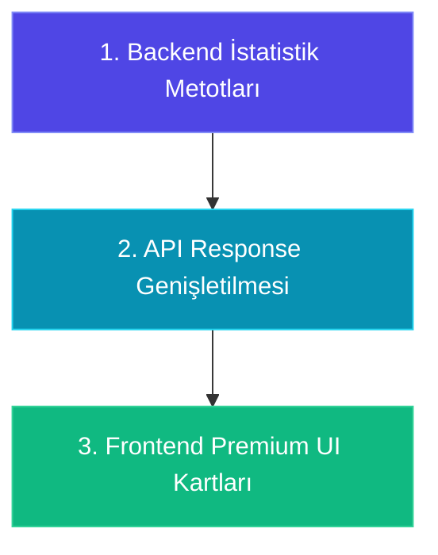

# Tenis Tahmin Motoru — Premium Analitik Paneli "Keşif Uçuşu" Raporu

Bu rapor, tenis tahmin motorumuzun arayüzünü (frontend) "Premium" bir analitik paneline dönüştürmek amacıyla gerçekleştirilen keşif uçuşunun teknik ve tasarımsal bulgularını içerir. Mevcut XGBoost modelimizdeki 10 temel özelliği, ziyaretçilerin ve bahisçilerin ilgisini çekecek analitik terimlere dönüştürmeyi; 3200+ oyuncunun yerel JSON geçmiş dosyalarından (son 50 maçlık havuz) çıkarılabilecek gizli istatistikleri ve maça özel **AI Edge Insight** (İngilizce Maç Hikayesi) üretimi için gerekli veri şablonlarını kapsar.

---

## 1. Mevcut Parametrelerin Çevirisi (Premium Arayüz Terimleri)

XGBoost modelimize beslenen 10 kritik diferansiyel özellik, arayüzde doğrudan teknik isimleriyle sunulmak yerine, spor analitiği ve premium bahis dünyasına hitap edecek terimlere dönüştürülmüştür. Bu terimler, kullanıcıya modelin "maçın röntgenini çektiğini" hissettirecek şekilde tasarlanmıştır.

| # | XGBoost Teknik Feature | Arayüz Terimi (EN / TR) | Önerilen İkon | Görselleştirme Şekli | Bahisçi Odaklı Açıklama (Pazarlama & Analitik Dili) |
|---|---|---|---|---|---|
| **1** | `feature_surface_rate` | **Court DNA** <br> Zemin Uyumu | 🏟️ | Dairesel Gauge veya Yüzde Barı | Oyuncunun bu maça özel zemin tipindeki (Toprak, Çim, Sert) kariyer/sezon galibiyet yüzdesi. |
| **2** | `feature_momentum_diff` | **Form Gauge Delta** <br> Form Dalgalanması | 📈 | Çift Yönlü Dinamik Kadran (-1.0 ile +1.0) | Son 10 maçtaki eksponansiyel form farkı. Yeni maçların ağırlığı yüksek olup, kimin daha "sıcak" seride olduğunu gösterir. |
| **3** | `feature_ground_diff` | **Surface Matchup Edge** <br> Zemin Avantajı | 🎯 | Neon Renkli Yüzde Rozeti | İki oyuncunun bu maça özel zemin performansları arasındaki net başarı farkı. |
| **4** | `feature_fatigue` | **Fatigue Index** <br> Fiziksel Aşınma / Yorgunluk | 🔋 | Pil Göstergesi (Yeşil / Sarı / Kırmızı) | Son 3 maçta oynanan toplam set sayısı. Yüksek set sayısı oyuncunun yorgun ve yıpranmış olduğunu gösterir. |
| **5** | `feature_rank_diff` | **Ranking Class Delta** <br> Klasman Farkı | 🏆 | Klasik Sayısal Fark | Oyuncuların ATP/WTA dünya sıralamasındaki makas farkı. Elit seviye farkını doğrudan ortaya koyar. |
| **6** | `feature_dominance_diff` | **Set Dominance Gap** <br> Set Eziciliği | ⚡ | İlerleme Barı / Fark Göstergesi | Oyuncuların geçmiş maçlarındaki "Kazanılan Set / Toplam Oynanan Set" oran farkı. Maçları domine etme gücünü temsil eder. |
| **7** | `feature_h2h_score` | **Nemesis Factor** <br> Psikolojik H2H | 🤝 | Bilanço Göstergesi (Örn: 3-1) | İki oyuncunun doğrudan geçmişteki randevularının model skoru. "Kimin kime şansının tutmadığının" matematiksel ifadesi. |
| **8** | `feature_game_dominance_diff` | **Game Control Advantage** <br> Oyun Hakimiyeti | 🎮 | İki Renkli Eşitlik Barı | Oyuncuların geçmiş maçlarındaki "Kazanılan Oyun / Toplam Oyun" oran farkı. Skorun ne kadar ezici olduğunu gösterir. |
| **9** | `feature_rest_days_diff` | **Recovery Window** <br> Dinlenme Penceresi | 💤 | Saat / Gün Farkı Göstergesi | Son maçtan bu yana geçen gün farkı delta değeri. Hızlı fikstür yorgunluğunu ve toparlanma avantajını gösterir. |
| **10** | `feature_surface_elo_diff` | **Elo Power Gap** <br> Zemin Elo Gücü | 🧠 | Güç Barı / Radar Grafik Delta | Zemine özel Elo puan farkı. Klasik sıralamanın aksine, oyuncunun o andaki zemin gücünü en saf gösteren veridir. |

---

## 2. JSON Havuzundan Çıkarılabilecek "Gizli İlginç İstatistikler"

Yerel oyuncu geçmiş dosyalarımız (`backend/app/sports/tennis/data/raw/player_matches/{player_id}.json`), her oyuncunun son 50 maçının detaylı zemin, turnuva ve set skoru verilerini barındırmaktadır. Bu 50 maçlık serüvenden, kural motoruna beslenebilecek ve arayüzde premium kartlar olarak sunulabilecek şu gizli metrikleri hesaplayabiliriz:

### A. Set ve Skor İstatistikleri
1. **"Clutch Gene" % (Deciding Set Win Rate / Karar Seti Başarısı):**
   * **Nasıl Hesaplanır:** 3 setlik maçlarda 2-1 biten, 5 setlik Grand Slam maçlarında 3-2 biten maçlar taranır. Bu maçlardan oyuncunun kazandığı maçların oranı bulunur.
   * **Arayüz Sunumu:** `Clutch Score: %72`. Oyuncunun baskı altındayken karar setlerinde ne kadar soğukkanlı olduğunu gösterir.
2. **Straight Sets Sweep Rate (Ezici Galibiyet Oranı):**
   * **Nasıl Hesaplanır:** Oyuncunun kazandığı maçlar içinden 2-0 (best-of-3) veya 3-0 (best-of-5) bitenlerin oranı.
   * **Arayüz Sunumu:** `Clean Sweep Rate: %65`. Maçları uzatmadan bitirebilen, enerjisini ekonomik kullanan oyuncuları bulmak için kritiktir.
3. **Battle-Tested Resilience (Savaşçı İndeksi):**
   * **Nasıl Hesaplanır:** Oyuncunun kazandığı maçlar içinde set kaybederek (2-1 veya 3-1/3-2) kazandığı maçların oranı.
   * **Arayüz Sunumu:** `Gritty Win %: %35`. Zor maçlarda pes etmeyip geri dönen karakterdeki oyuncuları vurgular.

### B. Zemin ve Fikstür İstatistikleri
4. **Surface Adaptation Gap (Zemin Geçiş Hassasiyeti):**
   * **Nasıl Hesaplanır:** Oyuncunun hedef zemin (Örn: Çim) galibiyet oranı ile diğer zeminlerdeki ortalama galibiyet oranı arasındaki fark.
   * **Arayüz Sunumu:** `Surface Specialist Delta: +%22` veya `Surface Liability: -%15`.
5. **Back-to-Back Tournament Fatigue (Turnuva Yıpranma Serisi):**
   * **Nasıl Hesaplanır:** Son 10 günde oynanan maçların farklı şehir/ülke turnuvalarında olup olmadığına bakılır. Yolculuk ve seyahat yükü puanlanır.
   * **Arayüz Sunumu:** `Travel Penalty: Alert (High)` veya `Active Exhaustion State`.
6. **Big Stage Performer Index (Büyük Sahne Oyuncusu):**
   * **Nasıl Hesaplanır:** Grand Slam veya Masters turnuvalarındaki (French Open, Wimbledon, Rome vb.) kazanma oranının, Challenger/ITF seviyesindeki kazanma oranına bölünmesi.
   * **Arayüz Sunumu:** `Big Match Temperament: Class A`. Oyuncunun büyük turnuvalarda vites yükseltip yükseltmediğini gösterir.

---

## 3. AI Edge Insight (Yapay Zeka Yorumu) Konsepti

MLB tahmin modelinde olduğu gibi, tenise özel bir **AI Narrative (İngilizce Maç Hikayesi)** oluşturmak, ziyaretçiyi sitede tutacak en önemli premium özelliktir. Bunun için modelin ürettiği diferansiyel metrikleri ve yukarıda hesaplanan geçmiş verileri bir araya getiren bir **Veri Şablonu (Context JSON)** ve **LLM Prompt Kuralı** tasarlanmıştır.

### A. AI Insight Veri Şablonu (Context JSON)
Her tahmin üretildiğinde, LLM'e (Gemini-1.5-Flash) aşağıdaki şablona sahip bir JSON bağlamı beslenecektir:

```json
{
  "match_info": {
    "home_player": "Sinner Jannik",
    "away_player": "Moutet Corentin",
    "tournament": "ATP London (Grass)",
    "surface": "Grass",
    "model_prob_home": 78.4,
    "model_prob_away": 21.6
  },
  "metrics_delta": {
    "court_dna_diff_p1": 0.18,
    "form_momentum_diff": 0.25,
    "fatigue_p1": 3,
    "fatigue_p2": 8,
    "rest_days_diff": 2,
    "surface_elo_diff": 210
  },
  "hidden_insights": {
    "p1_clutch_win_rate": 0.81,
    "p2_clutch_win_rate": 0.45,
    "p1_straight_sets_rate": 0.70,
    "p2_straight_sets_rate": 0.30
  },
  "odds": {
    "best_p1_odds": 1.30,
    "best_p2_odds": 3.80,
    "edge_percentage": 5.40
  }
}
```

### B. LLM Sistem Talimatı ve Prompt Kuralı (System Instruction)
Gemini servisine iletilecek sistem talimatı, bahis dünyasının popüler analiz siteleri (Covers, Action Network) dilinde yazılacaktır.

```markdown
You are a highly analytical, professional Tennis Sabermetrics & Betting expert providing automated, punchy pre-match insights for a premium sports betting terminal.
Your task is to analyze the provided player matchup JSON and return EXACTLY 3 BULLET POINTS (no introductory text, no conversational filler).

Follow this strict structure:
- Bullet 1 (The Surface & ELO Edge): Compare their Court DNA (surface success) and Surface ELO Gap, highlighting who dominates the target ground.
- Bullet 2 (Physical & Fatigue Factor): Contrast their Fatigue Index (sets played recently) and Recovery Window. Pinpoint if a player is entering depleted.
- Bullet 3 (The Betting Angle): Explicitly recommend the best mathematical play (Moneyline, Set Handicap, or Game Total) backed by the Edge or alternative market rules.
```

### C. Örnek Çıktı (Generated AI Narrative)
Yukarıdaki şablon çalıştırıldığında arayüzde görünecek premium AI Yorumu şu şekilde olacaktır:

> * **Court Mastery:** Jannik Sinner holds a staggering +210 Surface ELO advantage on Grass and enters with an 18% higher Court DNA, marking severe dominance on this surface.
> * **Physical Exhaustion:** Corentin Moutet is entering heavily fatigued with 8 sets played over the last 3 days, while Sinner enjoys a fresh profile (3 sets played) and a +2 day rest advantage.
> * **The Play:** With Sinner's high set dominance difference and Moutet's fatigue liability, the mathematical edge heavily points to a clean **Sinner -1.5 Sets** sweep.

---

## 4. Arayüz Entegrasyonu Yol Haritası

Bu istatistikleri ve AI anlatılarını Next.js frontend tarafımıza taşımak için izleyeceğimiz 3 adımlı yol haritası:



### Adım 1: Backend Veri Zenginleştirme (`predict.py`)
* `predict.py` içindeki tahmin döngüsünde `tennis_brain` geçmiş dosyaları taranarak **Clutch Win %**, **Straight Sets Sweep %** ve **Yolculuk Faktörü** asenkron olarak hesaplanacaktır.
* Bu veriler `today_predictions.json` dosyasına her maç objesinin altına `metrics` ve `ai_insight` anahtarlarıyla eklenecektir.

### Adım 2: AI Entegrasyonu (`app/services/ai/gemini.py`)
* Gemini/Groq asenkron entegrasyonu tenis pipeline'ına bağlanacak.
* Her gün 00:00 ve 12:00 ET'de çalışan zamanlayıcı, tahminleri ürettikten hemen sonra AI yorumlarını da üreterek JSON'a yazacaktır.

### Adım 3: Frontend Arayüz Parlatması (`TennisDashboard.jsx`)
* Maç kartı tıklandığında açılan akordeonun (Accordion) içine **"🔋 Fatigue Meter"**, **"🏟️ Zemin DNA Karşılaştırması"** ve **"🧠 AI Edge Insight"** sekmeleri yerleştirilecektir.
* Yüksek yorgunluk oranları kırmızı pil ikonuyla, yüksek karar seti başarısı ise alev (🔥) efektiyle parlatılacaktır.
