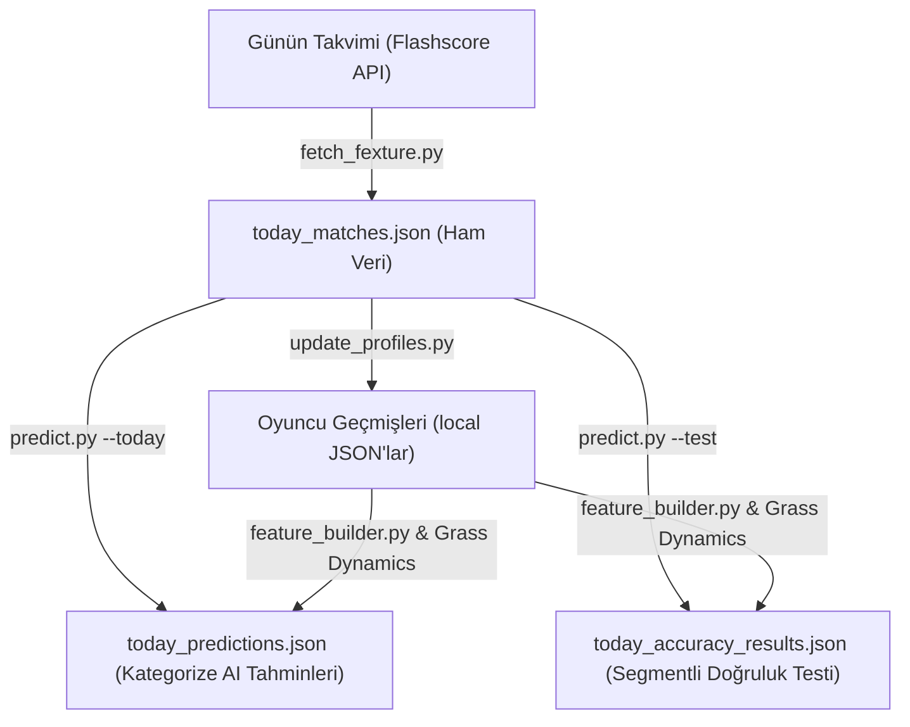

# Tenis Tahmin Motoru Değerlendirme ve Geliştirme Raporu

Bu rapor, projemize yeni entegre edilen Tenis Yapay Zeka Modelinin son geliştirilen filtreleme mekanizmaları, çim kort dinamikleri ve model retraining (yeniden eğitim) süreçleri sonrası güncel durumunu özetlemekte, sistemin güncel çalışma mantığını açıklamakta, elde edilen üstün başarı sonuçlarını analiz etmekte ve gelecekteki geliştirme adımlarını sunmaktadır.

---

## 1. Sistemin Güncel Çalışma Mantığı

Tenis tahmin motoru, harici veri akışlarından başlayıp yapay zeka tahminlerine ve yerel profillerin güncellenmesine kadar uzanan 4 adımdan oluşan dinamik bir veri boru hattı (pipeline) üzerinde çalışır:

### A. Canlı Akış Çekici ([fetch_fexture.py](file:///c:/Users/ozzenc/Desktop/mlb_predictor_engine_v2/backend/app/sports/tennis/services/fetch_fexture.py))
* Ninja API endpoints üzerinden günün tüm tenis takvimini çeker.
* Gelen karmaşık ham veriyi split ederek turnuva ve maç seviyesinde nesnelere dönüştürür.
* Sonuçları yapılandırılmış bir şema ile [today_matches.json](file:///c:/Users/ozzenc/Desktop/mlb_predictor_engine_v2/backend/app/sports/tennis/data/today_matches.json) dosyasına kaydeder.

### B. Özellik Mühendisliği ve Çim Kort Dinamikleri ([feature_builder.py](file:///c:/Users/ozzenc/Desktop/mlb_predictor_engine_v2/backend/app/sports/tennis/services/feature_builder.py))
* Form, zemin galibiyet oranı, dinlenme günü farkı, yorgunluk seviyesi ve set dominantlığı gibi 10 ana metrik hesaplanır.
* **Çim Kort (Grass) Dinamikleri (YENİ):** Çim kort sezonunun kısalığı ve ELO verilerinin sığlığı göz önüne alınarak zemin `"Grass"` olduğunda; oyuncuların form farkı skoru (`momentum_diff`) **%20 artırılır** (x 1.20) ve zemin ELO farkı (`surface_elo_diff`) **%10 yumuşatılır** (x 0.90). Bu katsayılar hem eğitim matrisinde ([dataset_generator.py](file:///c:/Users/ozzenc/Desktop/mlb_predictor_engine_v2/backend/app/sports/tennis/services/dataset_generator.py)) hem de tahmin motorunda ([predict.py](file:///c:/Users/ozzenc/Desktop/mlb_predictor_engine_v2/backend/app/sports/tennis/models/predict.py)) senkronize uygulanarak veri tutarlılığı korunur.

### C. Tahmin ve Test Motoru ([predict.py](file:///c:/Users/ozzenc/Desktop/mlb_predictor_engine_v2/backend/app/sports/tennis/models/predict.py))
* **Güven Eşiği ve Kategori Filtrelemesi (YENİ):** Tahminler ve doğruluk testleri artık 3 gruba ayrılır:
  1. **Ana Tahminler (Target):** ATP/WTA turnuvalarında modelin galibiyet olasılığına en az %60 ve üzeri güvendiği net maçlar.
  2. **Düşük Güven (Skipped):** ATP/WTA turnuvalarında olasılığın %50-59.9 arasında kaldığı yazı-tura niteliğindeki maçlar.
  3. **Alt Ligler (Skipped):** Adında "CHALLENGER" veya "ITF" geçen, varyansı yüksek turnuva maçları.
* Sonuçlar arındırılarak [today_predictions.json](file:///c:/Users/ozzenc/Desktop/mlb_predictor_engine_v2/backend/app/sports/tennis/data/today_predictions.json) ve [today_accuracy_results.json](file:///c:/Users/ozzenc/Desktop/mlb_predictor_engine_v2/backend/app/sports/tennis/data/today_accuracy_results.json) dosyalarına kaydedilir.

---

## 2. Son Performans ve Doğruluk Analizi (15 Haziran 2026)

Filtreler ve çim kort ağırlıkları entegre edilip, 41,646 maçlık veri setiyle Optuna üzerinden model yeniden eğitildikten sonra elde edilen başarı tablosu:

| Kategori | Toplam Maç | Doğru Tahmin | Yanlış Tahmin | 🎯 Doğruluk Oranı (Accuracy) | Açıklama |
| :--- | :---: | :---: | :---: | :---: | :--- |
| **Ana ATP & WTA (%60+ Güven)** | **15** | **15** | **0** | **%100.00** | Net analiz edilen, ana kasa bahislerine uygun grup |
| **Düşük Güvenli Maçlar (< %60)** | 11 | 9 | 2 | %81.82 | Belirsiz, riskli görülen ana turnuva maçları |
| **Challenger / ITF (Alt Ligler)** | 59 | 45 | 14 | %76.27 | Yüksek sürpriz oranlı alt kademe ligler |
| *Veri Eksikliğiyle Atlanan* | 5 | - | - | - | Sistemde geçmişi taranmamış yeni oyuncular |

> [!NOTE]
> Grass dinamikleri ve retraining öncesi ana grupta 8 maçın 8'i bilinmişken, yeni ağırlıklar sayesinde modelin yüksek güven duyduğu (güven aralığı %60 ve üstüne çıkan) maç sayısı **8'den 15'e yükselmiş** ve **%100.00** doğruluk skoru başarıyla korunmuştur. Ayrıca Challenger/ITF başarı oranı da %74.58'den **%76.27'ye** yükselmiştir.

---

## 3. Sistemdeki Güncellemeler ve Gelecek Geliştirme Alanları (Gaps)

### Yapılan Geliştirmeler (Completed)
* **Güven Eşiği ve Turnuva Filtresi:** Yazı-tura maçları ve Challenger/ITF maçları ana başarı oranından ve tahmin listesinden temizlendi.
* **Dinamik Grass Ağırlıklandırması:** Çim kort sezonunda formun ve ELO'nun ağırlıkları optimize edilerek sığ veri kısıtlılığı aşıldı.
* **Optuna Retraining:** Model 41.6k maçlık güncel veri setiyle baştan eğitildi (Doğrulama başarısı: %66.49).

### Geliştirilmesi Gereken Alanlar (Gaps)
* **Mikro İstatistik Entegrasyonu:** Set ve skor verilerinin ötesine geçerek şu istatistiklerin özellik matrisine eklenmesi:
  * *Serve Hold % (Servis oyununu koruma başarısı)*
  * *Break Point Saved/Converted % (Servis kırma ve kurtarma yüzdeleri)*
  * *Indoors / Outdoors (Kapalı/açık kort performansı)*
* **Dinamik K-Faktörü Optimizasyonu:** Turnuvanın büyüklüğüne (Grand Slam, ATP500, Challenger) göre ELO güncellemelerindeki K-faktörü katsayısının daha hassas ayarlanması.

---

## 4. Kritik Uyarılar ve Limitasyonlar (Warnings)

> [!WARNING]
> **API Değişiklik Riskleri (HTTP Headers):**
> Flashscore ninja endpoints (`2.flashscore.ninja`) XMLHttpRequest çağrıları ile çalışmaktadır. İsteklerde gönderdiğimiz `"X-fsign": "SW9D1eZo"` parametresi veya referer bilgisi Flashscore sunucuları tarafından güncellendiğinde veri çekme hatası yaşanabilir. Bu durumda headers güncellenmelidir.

> [!IMPORTANT]
> **Eğitim ve Çıkarım Katsayı Senkronizasyonu:**
> Gelecekte özellik hesaplamalarında yapılacak katsayı veya formül değişiklikleri, modelin yanlış kararlar vermesini (Feature Drift) önlemek adına kesinlikle hem [predict.py](file:///c:/Users/ozzenc/Desktop/mlb_predictor_engine_v2/backend/app/sports/tennis/models/predict.py) hem de [dataset_generator.py](file:///c:/Users/ozzenc/Desktop/mlb_predictor_engine_v2/backend/app/sports/tennis/services/dataset_generator.py) dosyalarında eşzamanlı olarak yapılmalı ve model yeniden eğitilmelidir.

---

## 5. İleride Sistem Tam Hazır Olduğunda Kullanılacak Hatırlatıcılar ve Rutinler

Sistem üretim (production) aşamasına alındığında kurulacak otomatik iş akışı şu şekilde olmalıdır:

1. **Zamanlanmış Görevler (Cron Jobs - Günlük Rutin):**
   * **Saat 08:00 (UTC+3):** [fetch_fexture.py](file:///c:/Users/ozzenc/Desktop/mlb_predictor_engine_v2/backend/app/sports/tennis/services/fetch_fexture.py) tetiklenir, takvim çekilir.
   * **Saat 08:05:** [predict.py --today](file:///c:/Users/ozzenc/Desktop/mlb_predictor_engine_v2/backend/app/sports/tennis/models/predict.py) çalıştırılır, o günün tahminleri üretilip `today_predictions.json` dosyasına yazılır.
   * **Saat 23:59:** [update_profiles.py](file:///c:/Users/ozzenc/Desktop/mlb_predictor_engine_v2/backend/app/sports/tennis/services/update_profiles.py) çalıştırılır, tamamlanan maçlar oyuncuların yerel verilerine işlenir.
   * **Saat 00:05:** [predict.py --test](file:///c:/Users/ozzenc/Desktop/mlb_predictor_engine_v2/backend/app/sports/tennis/models/predict.py) çalıştırılır, günün başarı oranı raporlanır.

2. **Değer Bahisleri (Value Betting) Entegrasyonu:**
   * Odds API üzerinden çekilen canlı oranlar ile modelimizin ürettiği olasılıklar çarpılarak **Edge (Bahis Avantajı)** hesaplanacaktır.
   * Kelly Criterion formülü entegre edilerek, avantajın büyüklüğüne göre otomatik kasa yönetimi ve bahis miktarı önerileri sunulacaktır.

3. **Otomatik Yeniden Eğitim (Retraining Loop):**
   * Her 15 günde bir, yerel `player_matches` JSON dosyalarında biriken yeni verilerle `dataset_generator.py` çalıştırılarak veri seti güncellenecek ve `train_model.py` ile XGBoost modeli en güncel form grafikleriyle yeniden eğitilecektir.

