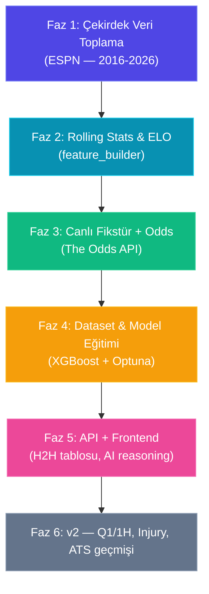

# 🏀 WNBA Tahmin Motoru — Makine Öğrenmesi & Premium Analitik Sistem Raporu

Bu rapor, MLB ve Tenis tahmin motorlarımızın mimarisini temel alarak WNBA (Women's National Basketball Association) için geliştirilecek makine öğrenmesi tabanlı tahmin motorunun veri gereksinimlerini, **ücretsiz veri kaynaklarını**, metrik yapılandırmasını, müşteri (Tyler) beklentilerini ve revize edilmiş uygulama yol haritasını detaylandırır.

> **Güncelleme notu:** İlk taslaktan farklı olarak bu revizyon; (1) ücretli API kullanımını kaldırır, (2) Tyler'ın gönderdiği referans ekran görüntülerindeki UI/model beklentilerini yansıtır, (3) veri toplamayı model geliştirmeden önce net fazlara ayırır.

---

## 0. Müşteri Gereksinimleri (Tyler Referansları)

Tyler WNBA için ham veri dosyası göndermemiştir; `backend/app/sports/wnba/data/images/` altındaki görseller **ürün referansı** niteliğindedir:

| Referans | İçerik |
|---|---|
| Covers.com H2H ekranı | Son 10 maç tablosu: tarih, skor, spread (ATS), O/U sonucu; özet W/L, ATS, O/U |
| UI blok listesi | Consensus plays, Q1/1H/team total projeksiyonları, last 10 recency (W/L + ATS + O/U), injury/lineup (kolaysa), AI reasoning |
| Model spec | Logistic regression veya gradient boosting; Home/Away + Last 5; PPG, OPPG, eFG%, Ortg, Drtg, Pace, TS%, Net Rating vb. |
| Q1 / 1st Half spec | Çeyrek ve yarı bazlı ayrı metrik setleri (L5 & L10, home/away split) |

**Önemli:** Covers ekranı **UI referansıdır**; veri kaynağı olarak Covers scraping hedeflenmez. Aynı H2H tablosu ESPN skorları + kendi hesaplamalarımızla üretilecektir.

---

## 1. WNBA Dinamikleri ve Tenis/MLB'den Farkları

WNBA, kendine has dinamikleri olan ve veri odaklı modellemede bazı avantaj ve zorluklar barındıran bir ligdir:

* **Takım Sayısının Azlığı:** Ligde sadece **12 takım** bulunmaktadır. Veri havuzu dar olsa da takımlar sık karşılaştığı için H2H ve matchup analizleri güçlüdür.
* **Kısa Sezon ve Maç Sayısı:** Her takım normal sezonda **40 maç** yapar. Geriye dönük veri havuzunun geniş tutulması elzemdir.
* **40 Dakikalık Maç Süresi:** WNBA maçları **4×10 dakika = 40 dakika** oynanır. Pace ve skor projeksiyonları buna göre normalize edilmelidir.
* **Dar Kadro ve Sakatlık Hassasiyeti:** Yıldız oyuncu eksikliği sonucu dramatik etkileyebilir — ancak otomatik injury feed **v2 kapsamına** alınmıştır.

**Mimari paralel:** Tenis pipeline'ı (`fetch → raw → feature_builder → dataset → train → predict → pipeline_runner`) birebir kopyalanabilir. WNBA takım sporu olduğu için fikstür/rest/B2B mantığı MLB'ye daha yakındır.

---

## 2. Veri Kaynağı Politikası

| Politika | Karar |
|---|---|
| Ücretli API (RapidAPI vb.) | **Kullanılmayacak** |
| Birincil kaynak | **ESPN** (fikstür, skor, box score, takım logoları) |
| Tarihsel doğrulama / advanced stats | **Basketball Reference** (scraping) |
| Resmi çeyrek/yarı verisi (v2) | **stats.wnba.com** (scraping) |
| Canlı bahis oranları | **The Odds API** — projede zaten `.env` ile kullanılıyor; WNBA sport key: `basketball_wnba` |
| UI referansı | **Covers.com** — sadece tasarım referansı, veri kaynağı değil |

---

## 3. Veri Kaynakları ve Adresleri

### 3.1 ESPN (Birincil — Ücretsiz, Resmi Olmayan Public API)

ESPN'ın `site.api.espn.com` endpoint'leri projede MLB logosu için zaten kullanılmaktadır. WNBA için aynı yapı geçerlidir.

| Amaç | URL | Notlar |
|---|---|---|
| **Günün fikstürü / skorboard** | `https://site.api.espn.com/apis/site/v2/sports/basketball/wnba/scoreboard` | Canlı ve bugünkü maçlar |
| **Belirli tarih skorboard** | `https://site.api.espn.com/apis/site/v2/sports/basketball/wnba/scoreboard?dates=YYYYMMDD` | Tarihsel maç toplama için ana endpoint |
| **Maç detayı / box score** | `https://site.api.espn.com/apis/site/v2/sports/basketball/wnba/summary?event={GAME_ID}` | Tam box score, skor, çeyrek skorları (varsa) |
| **Tüm takımlar** | `https://site.api.espn.com/apis/site/v2/sports/basketball/wnba/teams` | 12 takım ID, isim, kısaltma |
| **Takım fikstürü** | `https://site.api.espn.com/apis/site/v2/sports/basketball/wnba/teams/{TEAM_ID}/schedule?season={YEAR}` | Sezon bazlı maç listesi |
| **Takım istatistikleri** | `https://site.api.espn.com/apis/site/v2/sports/basketball/wnba/teams/{TEAM_ID}/statistics` | Sezon ortalamaları |
| **Lig standings** | `https://site.api.espn.com/apis/site/v2/sports/basketball/wnba/standings` | Sıralama tablosu |

**CDN — Takım / lig logoları (frontend):**

| Amaç | URL |
|---|---|
| WNBA lig logosu | `https://a.espncdn.com/i/teamlogos/leagues/500/wnba.png` |
| Takım logosu | `https://a.espncdn.com/i/teamlogos/wnba/500/{ABBREV}.png` |

Örnek takım kısaltmaları: `lv` (Las Vegas Aces), `ny` (New York Liberty), `chi` (Chicago Sky), `conn` (Connecticut Sun), `min` (Minnesota Lynx), `phx` (Phoenix Mercury), `sea` (Seattle Storm), `ind` (Indiana Fever), `atl` (Atlanta Dream), `was` (Washington Mystics), `dal` (Dallas Wings), `la` (Los Angeles Sparks).

**ESPN web (insan referansı):**

| Amaç | URL |
|---|---|
| WNBA ana sayfa | `https://www.espn.com/wnba/` |
| Skorboard | `https://www.espn.com/wnba/scoreboard` |
| Takım sayfası | `https://www.espn.com/wnba/team/_/name/{abbrev}/{team-slug}` |

---

### 3.2 Basketball Reference (Tarihsel — Ücretsiz, Scraping)

2016+ tarihsel veriyi doğrulamak ve advanced team stats için kullanılır. Resmi API yoktur; rate limit ve HTML yapısı değişimine dikkat edilmelidir.

| Amaç | URL |
|---|---|
| WNBA ana sayfa | `https://www.basketball-reference.com/wnba/` |
| Sezon özet istatistikleri | `https://www.basketball-reference.com/wnba/years/{YEAR}.html` |
| Sezon maç listesi | `https://www.basketball-reference.com/wnba/years/{YEAR}_games.html` |
| Takım sayfası | `https://www.basketball-reference.com/wnba/teams/{TEAM_ABBR}/{YEAR}.html` |
| Box score (maç) | `https://www.basketball-reference.com/wnba/boxscores/{YYYYMMDD}{TEAM_ABBR}.html` |

**Kullanım stratejisi:** ESPN birincil kaynak; Basketball Reference yalnızca eksik/geçmiş sezon doğrulaması ve Ortg/Drtg/Pace gibi advanced metriklerin cross-check'i için.

---

### 3.3 stats.wnba.com (Resmi — v2, Scraping)

Çeyrek (Q1) ve yarı (1H) bazlı istatistikler için gerekli. Full-game v1'de zorunlu değildir.

| Amaç | URL |
|---|---|
| Ana portal | `https://stats.wnba.com/` |
| Takım istatistikleri | `https://stats.wnba.com/teams/traditional/` |
| Maç box score | `https://stats.wnba.com/game/{GAME_ID}/` |

**Not:** NBA Stats portalı ile aynı altyapıyı kullanır; endpoint'ler dokümante değildir, network tab üzerinden keşfedilmelidir.

---

### 3.4 The Odds API (Canlı Oranlar — Mevcut Proje Altyapısı)

MLB'de kullanılan `OddsProvider` sınıfı WNBA için genişletilebilir. API key `.env` dosyasındaki `ODDS_API_KEY` ile gelir.

| Amaç | URL |
|---|---|
| WNBA canlı oranlar | `https://api.the-odds-api.com/v4/sports/basketball_wnba/odds?apiKey={KEY}&regions=us&markets=h2h,spreads,totals&oddsFormat=american` |
| Desteklenen sporlar listesi | `https://api.the-odds-api.com/v4/sports/?apiKey={KEY}` |
| Tarihsel odds (plan bağımlı) | `https://api.the-odds-api.com/v4/historical/sports/basketball_wnba/odds?...` |

**ATS / O/U geçmiş tablosu** için closing line gerekir. Ücretsiz tier yalnızca **canlı** oranları kapsar; geçmiş ATS/O/U v1'de sınırlı olabilir (bkz. Faz 3).

---

### 3.5 Covers.com (Yalnızca UI Referansı)

| Amaç | URL |
|---|---|
| WNBA H2H örnek ekran | `https://www.covers.com/sport/basketball/wnba/matchup/` |
| WNBA istatistikler | `https://www.covers.com/sport/basketball/wnba/stats` |

Veri kaynağı olarak kullanılmayacaktır.

---

## 4. Veri Havuzu Ne Kadar Büyük Olmalı?

WNBA'de sezon başına toplam maç sayısı:

* **Normal Sezon:** 12 takım × 40 maç / 2 = **240 maç**
* **Playoff + Commissioner's Cup:** ~**30–40 maç**
* **Sezon başına toplam:** ~275 maç

### Önerilen pencere: 2016 – 2026 (10 sezon)

* **Toplam:** ~**2.500 – 2.800 maç**
* **Neden 2016+?** Üç sayı hacmi ve tempo 2016 sonrası köklü değişti; daha eski veri gürültülüdür.
* **Model:** XGBoost / gradient boosting için yeterli hacim (Tyler spec ile uyumlu).

---

## 5. Veri Depolama Yapısı

Tenis mimarisine paralel dizin yapısı:

```
backend/app/sports/wnba/
  data/
    teams.json                    # 12 takım sabit referans (ESPN ID, abbrev, isim, logo URL)
    raw/
      games/
        2016.json … 2026.json     # Sezon bazlı maç sonuçları
      box_scores/
        {game_id}.json            # Maç bazlı box score
    processed/
      team_game_logs.json         # Takım-maç normalize log (rolling hesaplar için)
      team_season_stats.json      # Sezon ortalamaları
    today_matches.json            # Günlük fikstür
    today_predictions.json        # Model çıktısı
    images/                       # Tyler referans görselleri (UI spec)
  services/
    fetch_schedule.py
    fetch_box_scores.py
    feature_builder.py
    dataset_generator.py
  models/
    train_model.py
    predict.py
  pipeline_runner.py
```

### Minimum Viable Record (Faz 1 — her maç için)

```json
{
  "game_id": "401671234",
  "date": "2025-06-15",
  "season": 2025,
  "season_type": "regular",
  "home_team_id": "19",
  "away_team_id": "9",
  "home_score": 91,
  "away_score": 86,
  "home_box": {
    "FGM": 33, "FGA": 72, "3PM": 9, "3PA": 28,
    "FTM": 16, "FTA": 20, "OREB": 8, "DREB": 25,
    "AST": 22, "STL": 7, "BLK": 4, "TOV": 12, "PF": 18
  },
  "away_box": { "...": "..." }
}
```

Bu tek kayıttan türetilebilir: galibiyet target'ı, spread target'ı, total target'ı, rest days, B2B, H2H, rolling L5/L10 istatistikler.

---

## 6. Hangi Veriler Olmalı? (Katmanlar)

### A. Temel Box Score (Faz 1 — Zorunlu)

Son 5, 10 maç ve sezon ortalaması için:

* Points Scored / Allowed (PPG, OPPG)
* FG%, 3P%, FT%
* REB (OREB, DREB, TRB)
* AST, STL, BLK, TOV, PF

### B. Gelişmiş Metrikler (Faz 1 — Box Score'dan Hesaplanır)

Tyler spec ve model için:

1. **Offensive Rating (Ortg)** — 100 possession başına sayı
2. **Defensive Rating (Drtg)**
3. **Net Rating**
4. **Pace / Pace40** — 40 dakika normalize tempo
5. **eFG%** ve **Opponent eFG% (OeFG%)**
6. **TS%** ve **Opponent TS%**
7. **TOV%** ve **Opponent TOV%**
8. **Rebound %** (ORB%, DRB%, TRB%)
9. **FT Rate**
10. **AST/TOV ratio**
11. **Points off Turnovers** (box score'dan veya advanced feed)

> **PIE (Player Impact Estimate):** Takım seviyesinde v1'de opsiyonel; tam player-level feed gerektirir.

### C. Durumsal Veriler (Faz 1–2)

1. **Rest Days** — fikstürden hesaplanır
2. **Back-to-Back (B2B)**
3. **Home / Away split** — Tyler spec: L5 & L10 H&A
4. **H2H** — son 5–10 maç (Covers UI referansı)

### D. ELO (Faz 2)

Tenis modelindeki gibi margin-of-victory aware **Basketball ELO**.

### E. v2'ye Ertelenen Veriler

| Veri | Neden v2 |
|---|---|
| Q1 / 1st Half istatistikleri | Çeyrek/yarı box score gerekir (stats.wnba.com) |
| Injury / starting lineup | Ayrı feed veya manuel giriş |
| Clutch factor | Play-by-play veya çeyrek skorları |
| Travel / jetlag | Şehir koordinatları + mesafe hesabı |
| Historical ATS/O/U (closing lines) | The Odds API historical plan veya alternatif |
| Consensus plays | Aggregator veya manuel |

---

## 7. Model Özellikleri (Features)

### v1 — 12 Çekirdek Diferansiyel Feature (Home − Away)

Tyler'ın gradient boosting spec'i ile uyumlu; rapordaki 16 feature'ın uygulanabilir çekirdeği:

| # | Feature | Tyler Spec Karşılığı | Kaynak |
|---|---|---|---|
| 1 | `feature_net_rating_diff` | Net Rating | Box score hesap |
| 2 | `feature_elo_diff` | — | ELO modülü |
| 3 | `feature_ppg_diff` | PPG / OPPG | Box score |
| 4 | `feature_efg_diff` | eFG% / OeFG% | Box score hesap |
| 5 | `feature_tov_diff` | TOV% / Otov% | Box score hesap |
| 6 | `feature_pace_diff` | Pace/40 | Box score hesap |
| 7 | `feature_ts_diff` | TS% / OPP TS% | Box score hesap |
| 8 | `feature_reb_diff` | TRB% | Box score hesap |
| 9 | `feature_rest_diff` | — | Fikstür |
| 10 | `feature_b2b_fatigue` | — | Fikstür |
| 11 | `feature_h2h_edge` | H2H (Covers UI) | Tarihsel skorlar |
| 12 | `feature_hca_weight` | Home/Away split | Rolling L5 H&A |

**Rolling pencereler:** Tyler spec'e uygun olarak her metrik **Last 5** ve **Last 10** için ayrı hesaplanır; model eğitiminde L5 birincil, L10 destekleyici kullanılır.

### v2 — Ek Feature'lar

`feature_injury_impact`, `feature_clutch_factor`, `feature_travel_penalty`, `feature_ft_rate_diff`, Q1/1H bazlı feature setleri.

---

## 8. Model Çıktıları ve UI Blokları

### v1 Model Çıktıları

1. **Moneyline** — Ev / Deplasman kazanma olasılığı (XGBoost Classifier + Platt scaling)
2. **Point Spread** — Model spread projeksiyonu (XGBoost Regressor)
3. **Over/Under Total** — Toplam sayı projeksiyonu (XGBoost Regressor)
4. **AI Reasoning** — Gemini ile 3 maddelik maç analizi (tenis modeli pattern'i)

### v1 UI Blokları (Tyler referansına göre)

| Blok | v1 | Not |
|---|---|---|
| Maç kartı + projeksiyonlar | ✅ | Moneyline, spread, total |
| Last 10 W/L tablosu | ✅ | Skor + galibiyet; ESPN verisi |
| Last 10 ATS / O/U | ⚠️ Kısıtlı | Canlı odds var; geçmiş closing line sınırlı |
| Home/Away L5 istatistik paneli | ✅ | Tyler IMG_4397 spec |
| H2H tablosu (Covers tarzı) | ✅ | Skor, tarih, ev sahibi |
| AI reasoning | ✅ | Tenis pattern'i |
| Q1 / 1H projeksiyonları | ❌ v2 | Ayrı model + çeyrek verisi |
| Team totals (Q1/1H) | ❌ v2 | |
| Consensus plays | ❌ v2 | Manuel veya aggregator |
| Injury / lineup | ❌ v2 | "If easy" — Tyler notu |

---

## 9. AI Edge Insight (Yapay Zeka Maç Hikayesi)

Tenis modelindeki gibi, WNBA maçı tahmin edildiğinde Gemini'ye maç context'i beslenerek **3 maddelik AI analizi** üretilecektir.

```json
{
  "match_info": {
    "home_team": "Las Vegas Aces",
    "away_team": "New York Liberty",
    "model_prob_home": 62.4,
    "model_prob_away": 37.6,
    "model_spread": -4.5,
    "model_total": 168.5
  },
  "metrics_delta": {
    "net_rating_diff": 4.2,
    "elo_diff": 95,
    "rest_days_diff": 2,
    "b2b_fatigue_away": true,
    "h2h_last10": "8-2 home team"
  }
}
```

---

## 10. Revize Edilmiş Uygulama Yol Haritası

Öncelik: **Önce veri, sonra model.** Kod yazımına geçmeden önce Faz 1–2 tamamlanmalıdır.



### Faz 1 — Çekirdek Veri Toplama (Hafta 1–2)

**Kaynak:** ESPN `scoreboard?dates=` + `summary?event=`

- [x] `teams.json` — 12 takım ESPN ID mapping
- [x] 2016–2026 sezon maç sonuçları (`raw/games/{year}.json`)
- [x] Her maç için tam box score (`raw/box_scores/{game_id}.json`)
- [x] Veri kalite kontrolü: ~240 maç/sezon, duplicate yok, skor tutarlılığı

### Faz 2 — Feature Engineering (Hafta 2–3)

- [x] `team_game_logs.json` — normalize edilmiş takım-maç log
- [x] Rolling L5 / L10 + Home/Away split hesapları
- [x] Advanced metrik hesaplayıcı (Ortg, Drtg, Pace, eFG%, TS%, TOV%)
- [x] Basketball ELO modülü
- [x] H2H son 10 maç aggregator

### Faz 3 — Canlı Pipeline + Odds (Hafta 3)

**Kaynak:** ESPN scoreboard + The Odds API `basketball_wnba`

- [x] Günlük fikstür scraper (`today_matches.json`)
- [x] Canlı spread / total / moneyline (`OddsProvider` genişletmesi)
- [x] `pipeline_runner.py` — günlük otomatik güncelleme

### Faz 4 — Model Eğitimi (Hafta 4)

- [x] `dataset_generator.py` — eğitim matrisi (X, y)
- [x] XGBoost Classifier (moneyline) + Platt scaling
- [x] XGBoost Regressor (spread + total)
- [x] Optuna hiperparametre optimizasyonu
- [x] Backtest / doğruluk raporu

### Faz 5 — API & Frontend (Hafta 4–5)

- [ ] `GET /api/v1/wnba/predictions`
- [ ] Maç kartları: projeksiyonlar, L5 H&A stats, H2H tablosu (Covers tarzı)
- [ ] AI reasoning entegrasyonu
- [ ] CentralDashboard WNBA sekmesi aktifleştirme

### Faz 6 — v2 (Sonraki Milestone)

- [ ] Q1 / 1st Half modelleri (stats.wnba.com çeyrek verisi)
- [ ] Injury / lineup feed
- [ ] Historical ATS/O/U (closing line arşivi)
- [ ] Consensus plays
- [ ] Travel fatigue index

---

## 11. Tyler ile Netleştirilecek Noktalar

Veri toplamaya başlamadan önce:

1. **MVP onayı:** Full game (ML + spread + total) + H2H + L5 stats yeterli mi?
2. **Q1/1H:** v1'de şart mı, yoksa v2'ye bırakılabilir mi?
3. **ATS/O/U geçmişi:** Closing line olmadan sadece W/L tablosu kabul edilebilir mi?
4. **Consensus plays:** Manuel mi girilecek?

---

## 12. Özet

| Konu | Karar |
|---|---|
| ML yaklaşımı | XGBoost + diferansiyel feature — tenis pipeline paraleli |
| Veri kaynağı | ESPN (birincil) + Basketball Reference (doğrulama) — **ücretsiz** |
| Canlı odds | The Odds API `basketball_wnba` — mevcut proje altyapısı |
| İlk adım | 2016+ maç + box score toplama (Faz 1) |
| v1 kapsamı | Full game model + H2H + L5 H&A stats + AI reasoning |
| v2 kapsamı | Q1/1H, injury, historical ATS/O/U, consensus |

---

---

# WNBA Motor Durum Raporu — 21 Haziran 2026

> Bu bölüm, geliştirme sürecinde yaşanan bilgisayar kapatmaları nedeniyle yarım kalan işlemleri, mevcut sistemin çalışma durumunu, eksiklikleri ve yeni bilgisayarda yapılacak adımları belgelemektedir.

---

## A. Mevcut Sistem Durumu

### Tamamlanan Dosya Yapısı

```
backend/app/sports/wnba/
├── services/
│   ├── config.py              ✅ Tamamlandı
│   ├── espn_client.py         ✅ Tamamlandı
│   ├── stat_parser.py         ✅ Tamamlandı
│   ├── fetch_teams.py         ✅ Tamamlandı
│   ├── fetch_games.py         ✅ Tamamlandı
│   ├── fetch_box_scores.py    ✅ Tamamlandı
│   ├── bulk_fetch.py          ✅ Tamamlandı
│   ├── metrics.py             ✅ Tamamlandı
│   ├── team_game_logs.py      ✅ Tamamlandı
│   ├── elo.py                 ✅ Tamamlandı
│   ├── feature_builder.py     ✅ Tamamlandı (v2 — 19 feature)
│   ├── build_features.py      ✅ Tamamlandı
│   ├── fetch_schedule.py      ✅ Tamamlandı
│   ├── wnba_odds.py           ✅ Tamamlandı
│   └── validate_data.py       ✅ Tamamlandı
├── models/
│   ├── train_model.py         ✅ Tamamlandı (60-trial hedef, 5 ile yarım kaldı)
│   ├── predict.py             ✅ Tamamlandı
│   └── __init__.py            ⚠️ Eksik (import hatası riski)
├── pipeline_runner.py         ✅ Tamamlandı (6 adımlı)
├── __init__.py                ⚠️ Eksik
└── data/
    ├── raw/games/             ✅ 2016-2026 sezon dosyaları
    ├── raw/box_scores/        ✅ 2557 dosya
    ├── processed/
    │   ├── team_game_logs.json    ✅ 5112 satır
    │   ├── team_elo_history.json  ✅ 2556 maç ELO
    │   └── game_features.json     ✅ 2497 maç, 19 feature
    ├── models/
    │   ├── model_win.json         ⚠️ 5 trial ile eğitildi (60 gerekli)
    │   ├── model_spread.json      ⚠️ 5 trial ile eğitildi
    │   ├── model_total.json       ⚠️ 5 trial ile eğitildi
    │   ├── model_win_calibration.json  ✅
    │   └── metrics.json           ✅ (5-trial metrikleri)
    ├── today_matches.json     ✅ Çalışıyor
    ├── today_odds.json        ✅ Çalışıyor
    ├── today_predictions_raw.json  ✅ Çalışıyor
    └── today_predictions.json      ✅ Çalışıyor
```

**Eksik (Faz 5):**
```
backend/app/sports/wnba/
└── routes/
    └── predictions.py        ❌ Henüz yazılmadı
```

---

## B. Model Performansı — Mevcut Durum

Modeller **yeni 19-feature seti** ile ancak yalnızca **5 Optuna trial** ile eğitilmiştir. 60-trial hedeflenmişti; bilgisayar kapanması nedeniyle erken durdu.

### Karşılaştırmalı Metrikler

| Model | Versiyon | Accuracy/MAE | Baseline | İyileşme | Notlar |
|---|---|---|---|---|---|
| Win (v1) | 40 trial, 12 feature | %67.8 | %53.8 | **+14.0 puan** | En iyi win sonucu |
| Win (v2 mevcut) | 5 trial, 19 feature | %65.8 | %54.0 | +11.8 puan | Eksik optimize |
| Win (v2 hedef) | **60 trial beklenen** | ~%68-70 | — | — | Yeni bilgisayarda çalıştır |
| Spread (v1) | 40 trial, 12 feature | 10.44 MAE | 11.77 | -%11.3 | İyi |
| Spread (v2 mevcut) | 5 trial, 19 feature | 10.52 MAE | 11.78 | -%10.7 | Eksik optimize |
| Total (v1) | 40 trial, 12 feature | 14.55 MAE | 14.50 | -%0.3 | Zayıftı |
| **Total (v2 mevcut)** | **5 trial, 19 feature** | **14.30 MAE** | **14.57** | **-%1.8** | **Düzeldi — yeni feature'lar işe yaradı** |
| Total (v2 hedef) | **60 trial beklenen** | ~13.5-14.0 MAE | — | — | Yeni bilgisayarda çalıştır |

> **Önemli Bulgu:** Yalnızca 5 trial ile bile yeni mutlak PPG/DPP feature'ları Total modelini düzeltti (14.55 → 14.30 MAE). 60 trial ile daha büyük iyileşme beklenmektedir.

### Feature Önem Sırası (v2 Win Modeli)

| Sıra | Feature | Önem | Yorum |
|---|---|---|---|
| 1 | `feature_elo_diff` | %14.8 | ELO hâlâ en güçlü sinyal |
| 2 | `feature_net_rating_diff` | %6.7 | Defansif üstünlük |
| 3 | `feature_ts_diff` | %5.3 | Verimli hücum |
| 4 | `feature_efg_diff` | %4.9 | Etkili alan golü |
| 5 | `feature_away_def_abs` | %4.8 | **Yeni feature — ilk 5'e girdi** |
| 6 | `feature_pace_abs` | %4.7 | **Yeni feature — oyun hızı** |
| 7 | `feature_away_off_abs` | %4.7 | **Yeni feature** |

> Total modeli için `feature_pace_abs` (%8.1) birinci sıraya çıktı — bu beklenen ve doğru bir sonuç.

---

## C. Yarım Kalan İşlemler (Bilgisayar Kapanması)

### 1. 🔴 Kritik — Model Eğitimi Tamamlanmadı

**Sorun:** `train_model.py --trials 60` komutu çalışırken bilgisayar kapandı. Modeller 5 trial ile kaydedildi (60 yerine).

**Etki:** Modeller çalışıyor ama optimize değil. Win %65.8 yerine %67-70 olabilir. Total MAE 14.3 yerine 13.5-14.0 olabilir.

**Çözüm (yeni bilgisayarda):**
```powershell
cd C:\Users\ozzenc\Desktop\mlb_predictor_engine_v2\backend
uv run python -m app.sports.wnba.models.train_model --trials 60
```

### 2. ✅ `__init__.py` Dosyaları Mevcut

**Durum:** `backend/app/sports/wnba/__init__.py`, `backend/app/sports/wnba/models/__init__.py` ve `backend/app/sports/wnba/services/__init__.py` dosyaları var, sadece commit edilmemiş (untracked). Sorun yok.

### 3. 🟡 Orta — Logo URL'leri Null

**Sorun:** `today_predictions.json` içinde `home_logo: null`, `away_logo: null` görünüyor. ESPN'den logo URL'si çekilemiyor.

**Etki:** Frontend'de takım logosu görünmez.

**Çözüm:** `fetch_schedule.py` içindeki `_parse_game` fonksiyonunda logo parsing mantığı düzeltilmeli. ESPN logo endpoint'i farklı bir alan kullanıyor olabilir.

### 4. 🟢 Düşük — Adsız Takım ID'leri

**Sorun:** ELO sıralamasında bazı takımlar `ID:104959`, `ID:21` gibi görünüyor. Bunlar tarihsel WNBA franchise'ları (örn. San Antonio Stars, Sacramento Monarchs).

**Etki:** Aktif maçlarda bu ID'ler görünmez. Görsel kirlilik.

**Çözüm:** `config.py` içine tarihsel takım ID eşlemesi ekle.

### 5. ✅ Beklenmedik Güzel Sürpriz — Faz 5 Büyük Ölçüde Hazır

**Durum:** Önceki bir çalışma oturumunda Faz 5 bileşenleri kısmen oluşturulmuş. Şu an untracked (commit edilmemiş) durumda ama dosyalar mevcut ve çalışıyor.

**Mevcut dosyalar:**
| Dosya | Durum | İçerik |
|---|---|---|
| `backend/app/api/v1/wnba.py` | ✅ Var, **api.py'ye bağlı** | `GET /wnba/predictions` endpoint |
| `frontend/src/components/WnbaDashboard.jsx` | ✅ Var | Tam maç kartı bileşeni |
| `frontend/src/hooks/useWnbaPredictions.js` | ✅ Var | API bağlantısı + polling |
| `frontend/src/App.jsx` | ✅ Bağlı | `activeSport === 'wnba'` route'u mevcut |
| `frontend/src/utils/sports_config.js` | ✅ Bağlı | WNBA sport config tanımlı |

**Yapılacak:** Sadece bu dosyaları commit etmek ve test etmek yeterli. Eklenecek ek endpoint'ler:
- `GET /wnba/schedule` → today_matches.json
- `GET /wnba/standings` → ELO sıralaması

---

## D. Yarın Yeni Bilgisayarda Yapılacaklar — Öncelik Sırası

### Öncelik 1 — Hemen Yap (30 dakika)

```
1. git pull (son kod değişikliklerini al)
2. uv sync (bağımlılıkları kur)
3. __init__.py dosyalarını oluştur
4. Model eğitimini çalıştır:
   uv run python -m app.sports.wnba.models.train_model --trials 60
   → Bu ~15-20 dakika sürer, bilgisayarı kapatma
```

### Öncelik 2 — Model Doğrulama (15 dakika)

```
5. Metrics'i kontrol et:
   - Win accuracy > %67 olmalı
   - Total MAE < 14.0 hedef
6. Pipeline'ı test et:
   uv run python -m app.sports.wnba.pipeline_runner --skip-yesterday
7. today_predictions.json'un doğru çıktı verdiğini kontrol et
```

### Öncelik 3 — Faz 5 Tamamlama (45 dakika) ✅ Büyük Kısmı Hazır

```
8. Tüm WNBA dosyalarını commit et:
   git add backend/app/api/v1/wnba.py
   git add backend/app/sports/wnba/
   git add frontend/src/components/WnbaDashboard.jsx
   git add frontend/src/hooks/useWnbaPredictions.js
   git commit -m "feat: WNBA prediction engine - Faz 1-5"
   git push

9. Backend'i ayağa kaldır, endpoint'i test et:
   curl http://localhost:8000/api/v1/wnba/predictions

10. Frontend'de WNBA sekmesini aç, kartların göründüğünü kontrol et
```

### Öncelik 4 — Logo Fix (30 dakika)

```
12. fetch_schedule.py'de ESPN logo parsing'i düzelt
13. Takım logoları today_predictions.json'a girince frontend'de görünür olur
```

---

## E. Veri Havuzunu Zenginleştirmek için Öneriler

### Kısa Vadeli (v1 içinde, bu hafta)

| Veri | Kaynak | Komut/Yöntem | Beklenen Etki |
|---|---|---|---|
| 2026 sezon güncellemesi | ESPN | `pipeline_runner` günlük çalıştır | Total model için güncel skor ortalaması |
| Dünkü maçları ekleme | ESPN scoreboard | `pipeline_runner` (skip-yesterday olmadan) | ELO ve rolling average güncellenir |
| Takım logoları | ESPN teams API | `fetch_teams.py` güncellemesi | Frontend görsel kalitesi |

### Orta Vadeli (v1 iyileştirme, önümüzdeki 2 hafta)

| Veri | Kaynak | Açıklama | Etki |
|---|---|---|---|
| **Oyuncu yokluk verisi** | ESPN injuries feed | `https://site.api.espn.com/apis/site/v2/sports/basketball/wnba/news` + injury tag | En büyük kör nokta — star yokluğu tahminleri doğrudan etkiliyor |
| **Hakemler** | stats.wnba.com | Official referees per game → foul rate, pace | Total model için anlamlı |
| Rakip-düzeltmeli istatistik | Hesaplanabilir (mevcut data) | Opponent SRS score | Spread model iyileşmesi |

### Uzun Vadeli (v2, Faz 6)

| Veri | Kaynak | Açıklama |
|---|---|---|
| Q1 / 1H skor verileri | stats.wnba.com | Çeyrek/yarı bazlı model için |
| Kapanış line arşivi | OddsPortal / Pinnacle API | ATS/O/U tarihsel doğruluk |
| Travel fatigue | Taslak hesaplama | Deplasman mesafesi × arka arkaya deplasman |
| Hava durumu/salon | Kapalı salon — uygulanamaz | WNBA tüm maçlar kapalı alanda |

---

## F. Modeli Daha İyi Hale Getirme Yol Haritası

### Şu Anki Durum Özeti

| Bileşen | Puan | Durum |
|---|---|---|
| Veri kalitesi | 9/10 | 2497 maç, 11 sezon, 0 eksik feature |
| Win modeli | 7/10 | %65.8 (5-trial) → %68-70 hedef (60-trial) |
| Spread modeli | 6/10 | MAE 10.52 — çalışıyor, iyileştirme mümkün |
| Total modeli | 5/10 | MAE 14.30 — yeni feature'larla düzeldi, optimize edilmeli |
| Pipeline | 9/10 | 6 adım, tam otomatik |
| ELO sistemi | 8/10 | Sağlam, adsız ID'ler temizlenmeli |
| API/Frontend | 0/10 | Henüz başlanmadı (Faz 5) |

### Model İyileştirme Adımları (Sıralı)

**Adım 1 — Hemen (yeni bilgisayarda):** 60-trial eğitim
- Beklenen Win iyileşmesi: %65.8 → ~%68-70
- Beklenen Total iyileşmesi: 14.30 → ~13.5

**Adım 2 — Bu hafta:** Oyuncu yokluk feature'ı
- Eğer Caitlin Clark oynuyor mu? → binary feature
- İlk eklenmesi gereken en önemli contextual feature

**Adım 3 — Önümüzdeki 2 hafta:** Opponent-adjusted rolling
- Her takımın L5 istatistikleri rakip kalitesiyle normalize edilmeli
- Şu an zayıf rakiplere karşı yüksek skor ile güçlü rakiplere karşı aynı skor eşit ağırlık taşıyor

**Adım 4 — Faz 6:** Q1 / 1H modelleri
- stats.wnba.com'dan çeyrek verisi çekilmeli
- Ayrı bir XGBoost modeli eğitilmeli

---

## G. Pipeline Çalıştırma Komutları (Hızlı Referans)

```powershell
# Günlük pipeline (her sabah çalıştır)
uv run python -m app.sports.wnba.pipeline_runner

# Sadece fikstür + odds (model olmadan test)
uv run python -m app.sports.wnba.pipeline_runner --skip-yesterday

# Feature engineering yeniden çalıştır
uv run python -m app.sports.wnba.services.build_features

# Model eğitimi (tam)
uv run python -m app.sports.wnba.models.train_model --trials 60

# Model eğitimi (hızlı test)
uv run python -m app.sports.wnba.models.train_model --quick

# Sadece tahmin üret (model hazırsa)
uv run python -m app.sports.wnba.models.predict
```
